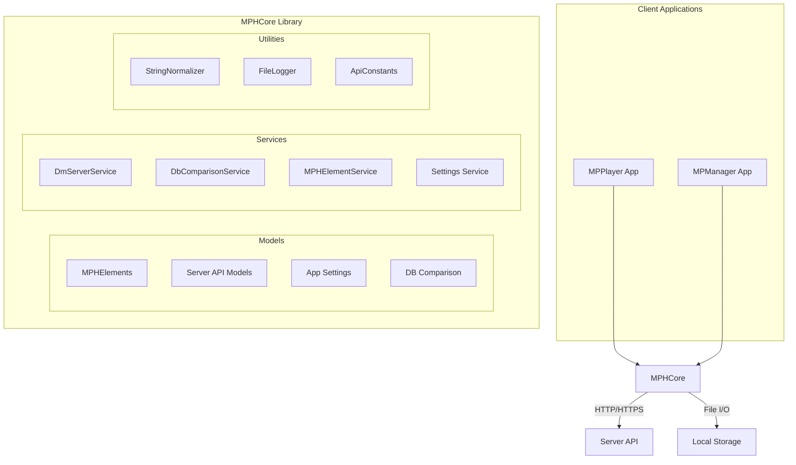
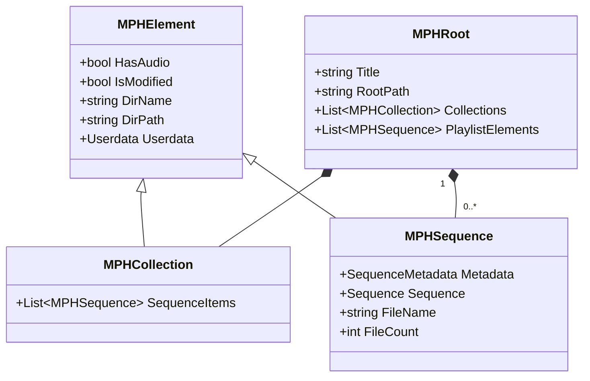
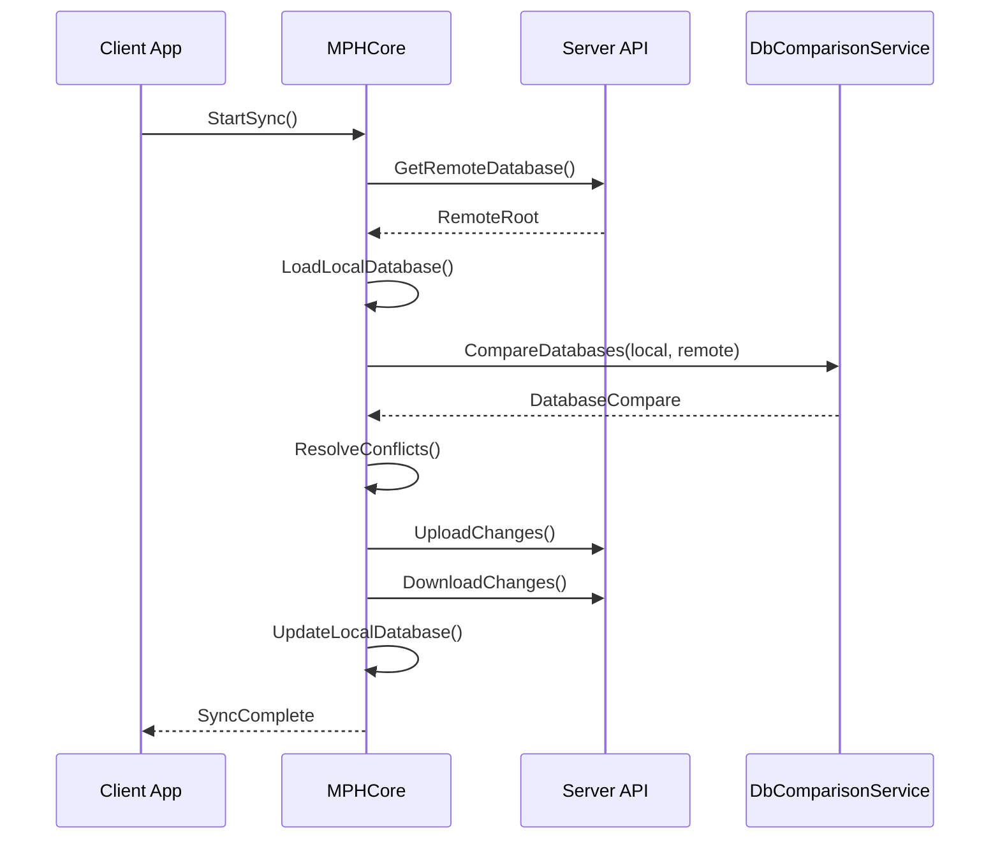
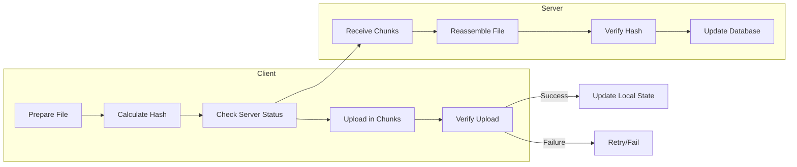

# MPHCore Library Architecture

## Table of Contents
1. [Overview](#overview)
2. [Architecture Diagram](#architecture-diagram)
3. [Core Components](#core-components)
   - [Models](#models)
   - [Services](#services)
   - [Utilities](#utilities)
4. [Key Flows](#key-flows)
5. [Design Patterns](#design-patterns)
6. [Error Handling](#error-handling)
7. [Security Considerations](#security-considerations)
8. [Performance Considerations](#performance-considerations)

## Overview

The MPHCore library serves as the backbone of the Dream Machine ecosystem, providing shared functionality between the MPPlayer and MPManager applications. It handles core business logic, data models, and server communication, ensuring consistency across different client applications.

## Architecture Diagram

## Core Components

### Models

The Models namespace contains the core data structures used throughout the application:

### Services

Key services that provide business logic and data access:

1. **DmServerService**: Handles all server communication
   - Authentication/Authorization
   - File upload/download
   - Program/Sequence management
   - Remote database operations

2. **DbComparisonService**: Compares local and remote databases
   - Identifies new/updated/deleted items
   - Tracks file differences
   - Generates sync recommendations

3. **MPHElementService**: Manages local Morpheus Hypno elements
   - Load/save operations
   - File system interactions
   - Metadata management

4. **SettingsService**: Manages application settings
   - User preferences
   - Connection settings
   - Local storage paths

### Utilities

- **StringNormalizer**: Ensures consistent string formatting
- **FileLogger**: Provides logging capabilities
- **ApiConstants**: Centralized API endpoint definitions

## Key Flows

### Database Synchronization

### File Upload/Download

## Design Patterns

1. **Repository Pattern**:
   - Centralized data access through services
   - Abstraction of data sources (local/remote)

2. **Dependency Injection**:
   - Services are injected where needed
   - Promotes testability and loose coupling

3. **Observer Pattern**:
   - Notifications for data changes
   - UI updates through data binding

4. **Strategy Pattern**:
   - Different comparison strategies
   - Pluggable authentication methods

## Error Handling

- Comprehensive exception handling
- Retry mechanisms for network operations
- Detailed logging for troubleshooting
- User-friendly error messages

## Security Considerations

- Secure token-based authentication
- HTTPS for all server communications
- Input validation and sanitization
- Secure credential storage

## Performance Considerations

- Efficient chunked file transfers
- Background processing for long-running operations
- Caching of frequently accessed data
- Lazy loading of large resources

## Future Enhancements

1. **Offline Support**:
   - Queue operations for when offline
   - Conflict resolution strategies

2. **Performance Optimization**:
   - Parallel processing for file operations
   - Compression for network transfers

3. **Enhanced Security**:
   - End-to-end encryption
   - Two-factor authentication

4. **Extensibility**:
   - Plugin architecture for custom features
   - Webhook support for integrations
