# Morpheus Editor

## Présentation et avantages

### Vision d'ensemble

Le Morpheus Editor révolutionne l'expérience de la Dream Machine en offrant une plateforme complète, intuitive et puissante pour créer, modifier et jouer des séquences de stimulation lumineuse. Cette application multi-plateforme transforme votre appareil en un studio de création professionnel pour l'exploration de la conscience.

### Pourquoi choisir Morpheus Editor

#### 🌟 Innovation technologique

- **Liberté de positionnement** : Lire, Éditer, Mettre en pause, Reprendre à n'importe quel emplacement dans une séquence
- **Multi-plateforme** : Fonctionne parfaitement sur Android, iOS, Windows et macOS
- **Interface adaptative** : S'adapte automatiquement à votre écran (smartphone, tablette, ordinateur)
- **Synchronisation automatique** : Vos séquences sont toujours à jour sur tous vos appareils

#### 🎯 Simplicité d'utilisation

- **Démarrage immédiat** : Connexion automatique à votre Dream Machine
- **Contrôles gestuels** : Balayages intuitifs sur mobile pour naviguer rapidement
- **Visualisation en temps réel** : Testez vos modifications instantanément

#### 🌍 Expérience internationale

- **Séquences bilingues** : Basculez automatiquement entre français et anglais
- **Descriptions contextuelles** : Chaque séquence est documentée et catégorisée
- **Audio adaptatif** : La bande sonore change selon la langue sélectionnée

#### 🛠️ Outils professionnels

- **Éditeur visuel avancé** : Timeline graphique avec forme d'onde audio, édition des méta informations. Ajout, suppression, découpage des étapes d'une séquence.
- **Générateurs aléatoires** : Permet de tester rapidement des réglages dans des plages prédéfinies.
- **Paramètres temps réel** : Idéal pour explorer des réglages complexes
- **Paramètres fins** : Contrôle précis des paramètres

### La Dream Machine : Rappel du principe

La Dream Machine de Dream Machine Tech utilise des flashs lumineux programmés pour induire des états modifiés de conscience. Inspirée des travaux de Brion Gysin et Ian Sommerville, elle stimule le nerf optique et le cortex visuel par des effets stroboscopiques précisément contrôlés, favorisant la relaxation, la méditation et l'exploration intérieure.

## Fonctionnement de la Dream Machine

Avant de décrire le programme Morpheus Editor nous allons rappeler rapidement le fonctionnement de la Dream machine.

### Contenu d'une Séquence

La Dream Machine est pilotée par des **séquences** définies par : un nom, une durée, un ensemble d'étapes (steps) qui permettent de commander des oscillateurs, des méta-data de documentation, et éventuellement des pistes audios. Chaque step de la séquence est défini par : sa durée et les paramètres de réglage des quatre oscillateurs.

### Fonctionnement des oscillateurs

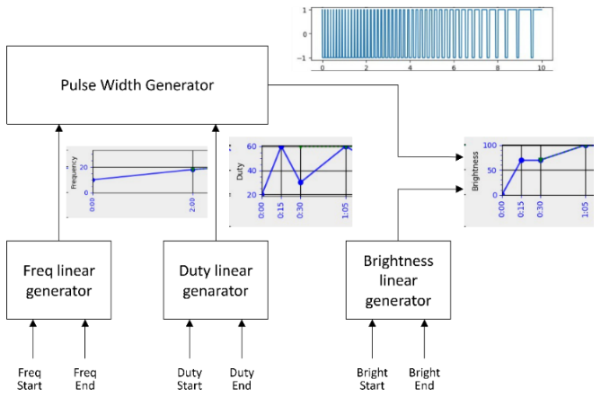{width="12cm"}

Chaque oscillateur génère un signal rectangulaire contrôlant un ou plusieurs groupes de LED.

Chaque oscillateur comprend :

- Générateur d'impulsions : Signal rectangulaire de base
- Modulateurs linéaires : Contrôle fréquence et facteur de forme
- Modulateur de luminosité : Contrôle d'amplitude

Pour chaque step de la séquence, on doit définir sa durée ainsi que les paramètres pour chaque oscillateur. Les paramètres des oscillateurs sont les suivants :

- La **fréquence** au début et à la fin du step
- Le **facteur de forme** au début et à la fin du step
- La **luminosité** au début et à la fin du step
- Les groupes de **LED**s utilisés

### Groupe de LEDs

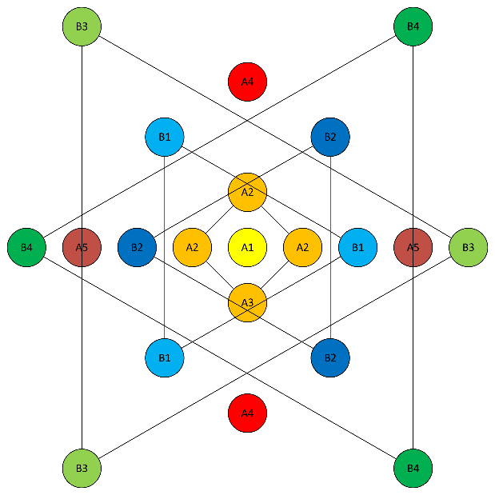

#### Groupes centraux (A)

- A1 : LED centrale unique
- A2 : 4 LED en carré autour du centre
- A4 : 2 LED verticales (haut-bas)
- A5 : 2 LED horizontales (gauche-droite)

#### Groupes périphériques (B)

- B1, B2, B3, B4 : 4 triangles de 3 LED chacun

**Règle importante** : Un groupe de LED ne peut être assigné qu'à un seul oscillateur à la fois.

Notez que pour des raisons historiques les groupes A3 et B5 ne doivent pas être utilisés.

## Organisation des données dans l'écosystème Morpheus

L'élément de base qui permet de commander la Dream Machine est la Séquence. Elle contient toutes les informations nécessaires au pilotage des LED de la Dream machine mais également les métadonnées de la séquence (documentation, niveau...) et éventuellement des pistes sonores.

Dans Morpheus, les séquences sont regroupées en Programmes (bibliothèques) sur des thèmes ou des origines variés. Il existe deux programmes particuliers :

- Un programme appelé « Sessions » qui contient les séquences de base de la Dream Machine.
- Un programme appelé « Playlist » qui contient les séquences favorites de l'utilisateur. Nous verrons plus loin comment cette playlist est maintenue par l'utilisateur.

## Détail de fonctionnement du Morpheus Editor

Le programme comporte plusieurs pages que nous allons détailler.

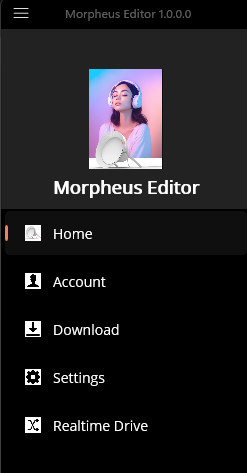{height="6cm"}

Pour naviguer entre les pages, cliquez sur le menu « hamburger » (trois barres) en haut à gauche et choisissez la page souhaitée (Home, Account, Download, Settings, Realtime Drive).

Au démarrage vous êtes sur la page d'accueil (Home)

### Page d'accueil : Votre tableau de bord

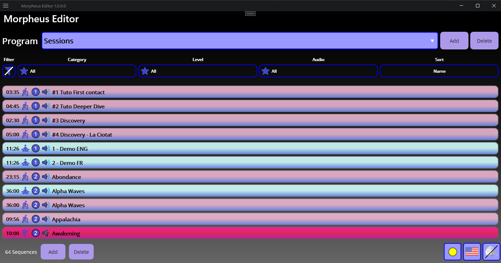

Au lancement, vous accédez à **un tableau de bord intuitif** qui centralise toutes les fonctionnalités

- **Une zone de sélection d'un programme**
  - **Affichage du programme actuel** : Sessions, Playlist, ...
  - **Add/Delete button** : Créez/Supprimez vos propres bibliothèques thématiques
  - **Navigation rapide** : Menu déroulant pour basculer entre programmes
- **Une zone d'outils de recherche intelligents**
  - **Filtrage avancé** : Par catégorie (Relaxation, Exploration, Stimulation), niveau d'intensité, présence audio
  - **Tri personnalisé** : Par durée, nom, popularité ou note utilisateur
  - **Réinitialisation** : Retrouvez la liste complète en un clic
- **Une zone de sélection des séquences**
  - Sélection de séquence présente une description courte de la séquence
  - Permet d'ajouter la séquence à votre playlist
  - Navigation vers les pages de lecture et d'édition
- **Une zone d'indicateurs**
  - Statut de la synchronisation avec le serveur de séquence
  - Sélection de la langue
  - Statut de connexion à la Dream Machine

Grâce à cette organisation claire et à ces fonctionnalités avancées, la page d'accueil devient un véritable tableau de bord interactif, permettant à chacun de gérer, personnaliser et explorer facilement l'ensemble de ses séquences pour tirer le meilleur parti de la Dream Machine.

Nous allons maintenant détailler chacune des sections de cette page.

#### Zone de Sélection / Ajout / Suppression des "Collections"

Le premier bouton permet de sélectionner un programme ou playlist existant. Cliquer sur ce bouton fait apparaître la liste des programmes afin de permettre à l'utilisateur d'en sélectionner un.

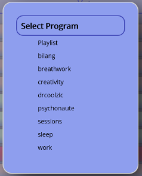{height=6cm}

Le bouton **Add** permet de créer un nouveau programme, et le bouton **Delete** permet de supprimer un programme existant.

**Attention** la suppression d'un programme entraîne la suppression de toutes les séquences qu'il contient.

#### Zone de filtrage et de tri

Cette section comporte un bouton pour réinitialiser les filtres, trois boutons pour filtrer les séquences en fonction de différents critères, et un bouton pour les trier.

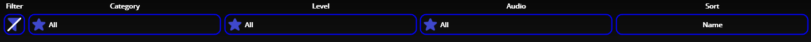

Il est possible de filtrer la liste des séquences par **catégorie**, par **niveau**, par la **présence d'audio** ou une combinaison de ces différents critères.

Pour affiner la recherche dans la liste des séquences, il suffit de cliquer sur le bouton associé au critère de filtrage souhaité. Cette action fait apparaître une fenêtre flottante permettant de sélectionner précisément l'entrée recherchée.

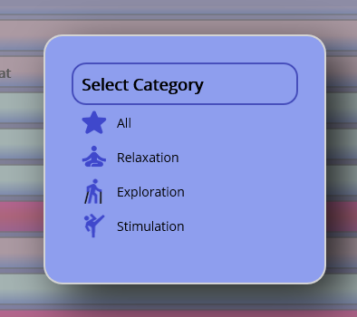{height=6cm}

Par exemple, si vous souhaitez filtrer par catégorie, il vous suffit de cliquer sur le bouton « Catégorie » : un menu flottant s'ouvre alors, affichant l'ensemble des catégories disponibles. Après avoir choisi une catégorie, seules les séquences correspondant à ce critère seront affichées, ce qui simplifie considérablement la navigation et la personnalisation de l'expérience utilisateur. À tout moment, il est possible de réinitialiser la recherche en annulant tous les filtres appliqués grâce au premier bouton, permettant ainsi de retrouver l'intégralité de la liste des séquences en un seul geste.

En complément du filtrage, l'interface propose également des fonctionnalités avancées de tri. Les séquences peuvent ainsi être triées selon différents critères : par nom, par durée, par catégorie, par niveau d'intensité, par présence d'une bande sonore, ou encore par la note utilisateur. Il suffit de cliquer sur le bouton de tri et de choisir dans le menu déroulant le critère.

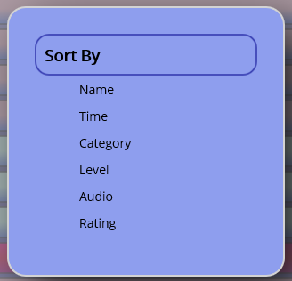{height=6cm}

Il est possible de combiner le tri et le filtrage afin de permettre à chacun de trouver rapidement les séquences qui correspondent le mieux à ses attentes ou à son humeur du moment.

#### Zone de Visualisation / Sélection des séquences

Les séquences sont regroupées dans une liste déroulante intuitive qui offre à l'utilisateur une vue d'ensemble claire et structurée.

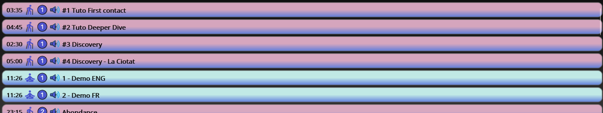

Chaque séquence affiche des informations essentielles :

- ⏱️ **Durée** : En minutes:secondes pour planifier votre session
- 🎨 **Catégorie** : Couleur de fond selon le type (Relaxation/Exploration/Stimulation)
- 📊 **Niveau** : Confortable, Modéré ou Intense selon votre sensibilité
- 🔊 **Audio** : Icône indiquant la présence d'une bande sonore
- 🎯 **Nom** : Nom de la séquence dans la langue sélectionnée.
- 🌟 **Notation** : Vos évaluations personnelles (0 à 5 étoiles)

Lorsque vous sélectionnez une séquence dans la liste celle-ci est développée afin d'afficher un texte qui résume ses caractéristiques ainsi que trois boutons.

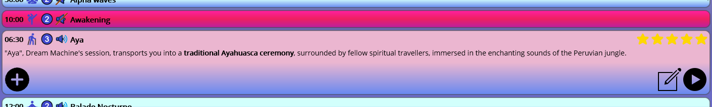

- Le premier bouton situé à gauche vous *permet d'ajouter* cette séquence à votre **Playlist**. Cette action peut être déclenchée par un balayage à gauche sur un téléphone.
- Le second bouton situé à droite vous permet de naviguer vers la page d'édition afin que vous puissiez éditer cette séquence
- Le troisième bouton situé à droite vous permet de naviguer vers la page [lecture de séquences](#page-dédition-des-séquences) afin de lancer la lecture de cette séquence. Cette action peut être déclenchée par un balayage à droite sur un téléphone.

#### Zone d'information et gestion des séquences

Le premier champ indique le nombre de séquences après filtration.
Il est suivi de deux boutons qui permettent de créer une nouvelle séquence ou de supprimer des séquences que vous ne voulez pas conserver.
Lorsque vous ajoutez une nouvelle séquence l'application vous demande le nom et vous déplace automatiquement sur la page d'édition de séquence.

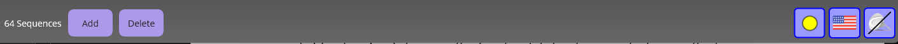

Il est **important** de noter que lorsque vous supprimez une séquence toutes les informations liées à cette séquence sont également supprimées (les descriptions, les commandes de LED, les fichiers son).

On trouve ensuite trois indicateurs :

- Le premier est un point de couleur qui indique le statut de la connexion au serveur :

  🔵 **Bleu** : Démarrage en cours
  ⚪ **Gris** : Hors ligne (le programme fonctionne quand même avec les séquences locales)
  🔴 **Rouge** : Connexion requise au serveur
  🟢 **Vert** : Tout est synchronisé
  🟡 **Jaune** : Mise à jour disponible

- On trouve ensuite un drapeau qui permet de sélectionner la langue utilisée par l'application. Pour le moment seules les langues **Français** et **Anglais** sont disponibles mais l'application est conçue pour supporter d'autres langues. Noter qu'il existe des séquences qui disposent d'un audio en Français et en Anglais (**séquence bilingue**). Dans ce cas non seulement le texte de description est choisi en fonction de la langue sélectionnée *mais la bande son est également sélectionnée en fonction de la langue.*
- Le troisième indicateur vous signale si vous êtes connecté en Bluetooth à la Dream Machine. Si l'application n'arrive pas à se connecter à la Dream Machine elle réessaie régulièrement à se connecter sans que vous n'ayez rien à faire. Il suffit donc d'allumer votre lampe quand vous êtes prêt et la connexion se fera automatiquement

### Page d'édition des séquences

Cette page est le cœur de Morpheus Editor car c'est là qu'il est possible de modifier tous les paramètres d'une séquence : Nom de séquence, Paramètres des oscillateurs, durée des steps, ...

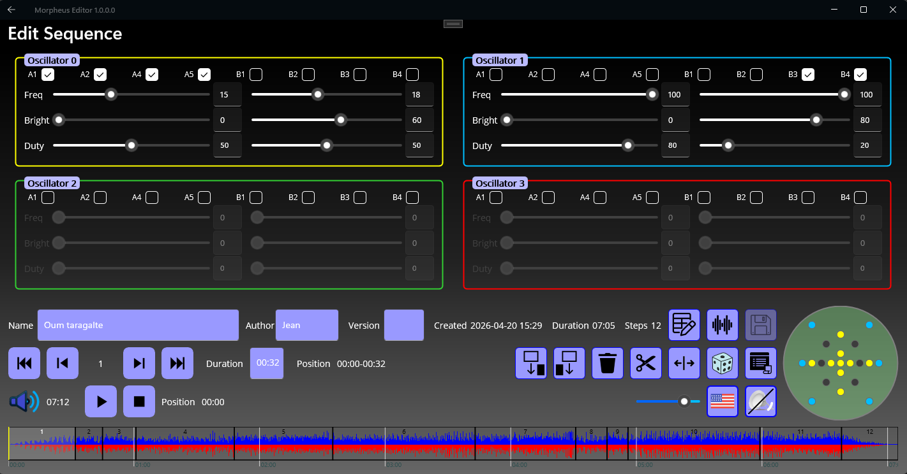

#### Paramètres des 4 oscillateurs

La Dream Machine possède 4 Oscillateurs numérotés de 0 à 3 qui sont visualisés en haut de la page d'édition. Notez que chaque oscillateur est entouré par une bordure de couleur. Cette même couleur est utilisée pour visualiser les groupes de LED utilisés par chaque oscillateur.

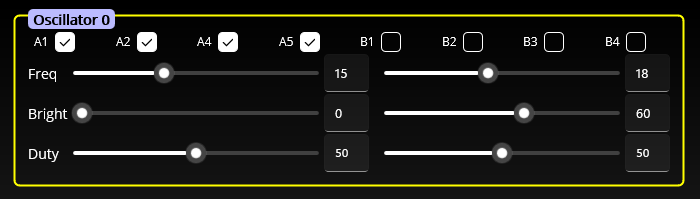

On a la possibilité de régler pour chacun des quatre oscillateurs les paramètres suivants :

- La sélection des groupes de LED qui sont commandés par cet oscillateur (voir la description des [groupes de LED](#groupe-de-leds)). Pour chaque oscillateur on peut sélectionner un ou plusieurs groupes de LED. Noter qu'on ne peut pas utiliser un groupe de LED qui est déjà utilisé par un autre oscillateur. Par exemple il n'est pas possible d'utiliser le groupe A2 dans l'oscillateur numéro 2 si ce même groupe est déjà utilisé dans l'oscillateur numéro 1. Pour sélectionner ou désélectionner un groupe de Led il suffit de cliquer la check-box correspondante.
- Les fréquences en Hz de l'oscillateur au départ et à la fin du step. Il est possible de spécifier ces valeurs soit avec un curseur soit en entrant la valeur. Avec les curseurs il est possible de spécifier uniquement des valeurs entières comprises entre 1 et 40. Cependant il est possible d'entrer n'importe quelle valeur décimale (avec un chiffre après la virgule) dans les champs correspondants. Il est possible par exemple de spécifier des valeurs comme 0.5, 12.3, 200 ...
- Les luminosités en pourcentage au départ et à la fin du step. Il est possible de spécifier ces valeurs soit avec un curseur soit en entrant la valeur. Avec les curseurs il est possible de spécifier uniquement des valeurs entières comprises entre 1 et 100. Cependant il est possible d'entrer n'importe quelle valeur décimale (un chiffre après la virgule) dans les champs correspondants. Il est possible par exemple de spécifier des valeurs comme 0.5, 12.3 ....
- Le rapport de forme en pourcentage au départ et à la fin du step. Il est possible de spécifier ces valeurs soit avec un curseur soit en entrant la valeur. Avec les curseurs il est possible de spécifier uniquement des valeurs entières comprises entre 5 et 95 (intervalle recommandé). Cependant il est possible d'entrer n'importe quelle valeur décimale (un chiffre après la virgule) dans les champs correspondants. Il est possible par exemple de spécifier des valeurs comme 0.5, 100

#### Paramètres et commandes de séquence

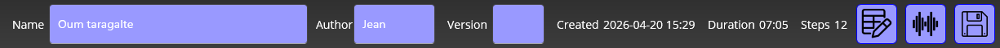

- Le champ **Name** spécifie le nom de la séquence. Il est possible de modifier ce nom et la modification est prise en compte lorsque l'on valide avec la touche entrée.
- Le champ **Author** est facultatif et permet d'indiquer le nom de l'auteur de la séquence.
- Le champ **Version** est un champ facultatif qui permet de spécifier la version de la séquence
- Le champs **Created** indique la date de création/sauvegarde de la séquence. Il est automatiquement géré par l'éditeur
- Le champ **Duration** indique la durée en minutes : seconds de la séquence.
- Le champ **Steps** indique le nombre de step que la séquence contient
- Un premier bouton permet de se rendre sur la page d'édition des métadonnées décrite plus loin
- Un deuxième bouton permet de se rendre sur la page d'édition de l'audio associé à la séquence.
- Le dernier bouton permet de sauvegarder la séquence que vous avez modifiée. Au départ le bouton est grisé (et inopérant) pour indiquer que la séquence n'a pas été modifiée. Dès qu'un paramètre de séquence, de step, d'oscillateur ... est modifié le bouton est disponible pour sauvegarder sur disque les modifications que vous avez faites. Si vous essayez de quitter la page d'édition sans avoir sauvegardé les informations une fenêtre contextuelle vous invitera à le faire.

#### Paramètres et commandes de Step

On a une première section :

- Le premier bouton permet de sélectionner le premier step de la séquence
- Le bouton suivant permet de sélectionner le step précédent
- Le champ suivant indique le numéro du step sélectionné
- Le bouton suivant permet de sélectionner le step suivant
- Le bouton suivant permet de sélectionner le dernier step de la séquence
- Le champ **Duration** indique la durée du step en mm:ss. Il est possible de modifier ce champ en entrant la durée désirée soit en secondes soit en mm:ss. Le champ est validé par la touche entrée.
- Le champ suivant indique la position du step dans la séquence. Le format est le suivant la position de départ du step en mm:ss tiret la position de fin du step en mm:ss. Par exemple si on a la valeur suivante 07:45 -- 08:30 cela indique que le step démarre à 7 minutes et 45 secondes et se termine à 8 minutes et 30 secondes

On a une seconde section avec les boutons suivants :

- Le premier bouton permet **d'insérer** un step avant le step courant. Les différents paramètres du nouveau step sont choisis de manière aléatoire (voir spécification des paramètres aléatoires ci-dessous). La position et l'index des steps suivant le step ajouté sont automatiquement ajustés.
- Le bouton suivant permet **d'ajouter** un step après le step courant. Les différents paramètres du nouveau step sont choisis de manière aléatoire (voir spécification des paramètres aléatoires ci-dessous). La position et l'index des steps suivant le step ajouté sont automatiquement ajustés.
- Le bouton suivant permet de **supprimer** le step courant. La position et l'index des steps suivants le step supprimé sont automatiquement ajustés.
- Le bouton suivant permet de **couper** en 2 le step courant. Une fenêtre contextuelle s'ouvre et permet de préciser la position du curseur à l'endroit de la coupure. Durant cette opération les différents paramètres sont calculés afin de maintenir un fonctionnement similaire des oscillateurs avant la coupure. Par exemple supposons que l'on ait un step qui démarre à 0s et se termine à 30s et dont les paramètres de fréquence sont au démarrage 10 Hz et à la fin 20 Hz. Si on fait une coupure à la 15^ème^ seconde alors la valeur de fin du premier step et celle de début du step suivant seront de 15 Hz. Cela s'applique évidemment à la luminosité et aux facteurs de forme.
- Le bouton suivant permet de **déplacer** la fin du step courant. Cette commande est pratique pour ajuster la limite entre 2 steps sans pour autant changer la longueur de la séquence complète. Une fenêtre contextuelle s'ouvre et permet de préciser le temps de fin de step. Par exemple si le step démarre à 0s et se termine à 23s, si on déplace la fin du step à 30 secondes alors le step suivant démarrera à 30 secondes et sera raccourci de 7 secondes.
- Le bouton suivant permet de **randomiser** tous les paramètres des 4 oscillateurs dans les limites définies par les paramètres aléatoires (voir spécification des paramètres aléatoires ci-dessous). Sont choisis de manière aléatoire les paramètres suivants :
  - le nombre d'oscillateur,
  - les groupes de LED par oscillateur,
  - la fréquence de début et de fin par oscillateur,
  - la luminosité de début et de fin par oscillateur,
  - le facteur de forme de début et de fin par oscillateur.
- Le bouton suivant ouvre une fenêtre contextuelle qui permet de spécifier les paramètres des générateurs aléatoires. Pour chacun des paramètres il est possible de définir une valeur minimum et maximum de début ainsi qu'une valeur minimum et maximum de fin. Par exemple il est possible de spécifier une fourchette entre 5 et 10 pour la fréquence de début et une fourchette entre 7 et 12 pour la fréquence de fin. Il est également possible de spécifier si on veut que la durée du step change de manière aléatoire ou bien si elle reste fixe. Si l'on choisit que la durée soit aléatoire il est alors possible de définir une valeur minimum et une valeur maximum qui sera choisie pour la durée du step. Si l'on veut juste changer les paramètres des oscillateurs sans déplacer les steps dans la séquence il faut alors décocher la randomisation de la durée.

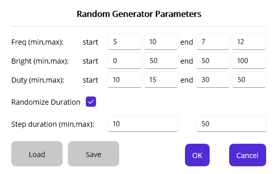{width=8cm}

#### Paramètres et commandes audio, luminosité, langue et connexion

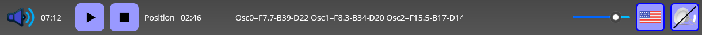

On a une première section pour contrôler la lecture de la séquence :

- On trouve d'abord un indicateur pour signaler si la séquence a une piste audio ou non.
- Si la séquence a une piste audio le champ suivant indique la durée en mm:ss de l'audio. Notez que d'une manière générale cette valeur doit en général être proche de la durée de la séquence. Si la durée de l'audio est plus courte que celle de la séquence cela indique qu'il y aura une partie de la séquence sans son. Si la durée de l'audio est plus longue que celle de la séquence à ce moment-là l'audio sera tronqué à la longueur de la séquence.
- Le bouton suivant permet de lancer la lecture de la séquence à la position où se trouve actuellement le curseur. Dès que la lecture de séquences est activée le bouton se transforme en bouton pause qui permet à tout instant de mettre la lecture de la séquence en pause. La mise en pause arrête bien entendu le son mais cela produit également l'extinction des LED. Un nouvel appui sur ce bouton relance la lecture de la séquence **exactement à l'endroit** où il avait été mis en pause.
- Le champ suivant indique la position du curseur de lecture en minutes, secondes, et dixièmes de secondes.
- Le champ suivant indique la valeur courante des différents paramètres pour les différents oscillateurs. Dans cet exemple l'oscillateur 0 a une fréquence de 7.7 Hz, une luminosité de 39 et un facteur de forme de 22, l'oscillateur 1 a une fréquence de 8.3 Hz, une luminosité de 34 et un facteur de forme de 20, ... {width=9cm}
- On trouve ensuite un curseur qui permet de régler la luminosité globale de la Dream machine. Par défaut ce curseur se trouve à une valeur de 80%.
- On trouve ensuite un bouton drapeau qui permet de changer la langue.
- Et enfin on trouve un indicateur pour signaler si la Dream Machine est connectée ou non. Si l'icône de la Dream machine est barrée d'un trait noir cela indique que vous n'êtes pas connecté et dans ce cas vous voyez un indicateur d'activité qui vous montre que le programme est en cours de recherche de la Dream Machine.

#### Indicateur des groupes de LED utilisés

Cet indicateur permet de visualiser tous les LED utilisés par les différents oscillateurs à un instant donné (step).

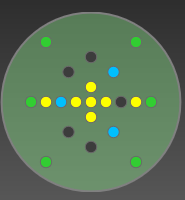

Les couleurs correspondent aux différents oscillateurs  : jaune pour l'oscillateur 0, bleu pour l'oscillateur 1, vert pour l'oscillateur 2, et rouge pour l'oscillateur 3. Si un groupe de LED n'est pas affecté à un oscillateur sa couleur apparaît en gris foncé.

#### Timeline et forme d'onde

On trouve au bas de la page d'édition une timeline qui permet de visualiser graphiquement les différents steps de la séquence.
À l'intérieur de la timeline la forme d'onde de l'audio associé à la séquence est affiché. Cela permet de visualiser la position des steps par rapport à l'audio.

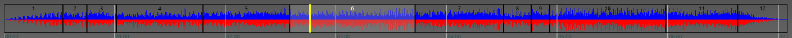

Chaque step est séparé du suivant par une barre verticale noire et comporte en son centre le numéro du step (uniquement s'il y a suffisamment de place pour l'afficher). En dessous de la timeline on trouve la graduation de l'axe des x qui est indiqué en mm:ss. La position du curseur de lecture est indiquée en jaune. Les barres blanches sont les graduations de l'axe des temps en mm :ss

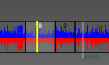

#### Positionnement et utilisation du curseur

La page d'édition utilise la notion de curseur pour indiquer la position actuelle de la « tête de lecture ». Ce curseur peut être modifié de différentes façons :

- Le curseur avance automatiquement lorsque le lecteur est en cours d'utilisation.
- Par l'utilisation des boutons de changement de step : premier, précédent, suivant, dernier step
- Il est également possible de positionner le curseur n'importe où (même en cours de lecture) en cliquant directement la barre de timeline.

Dès que le curseur est déplacé, tous les champs de l'éditeur sont automatiquement mis à jour. Par exemple, si vous cliquez sur une position spécifique dans une étape (step), le numéro de l'étape est mis à jour, les paramètres des différents oscillateurs sont mis à jour et l'affichage des LEDs est mis à jour.

Après avoir positionné le curseur à un endroit quelconque de la séquence, le bouton lecture démarrera la lecture de la séquence à cet endroit (l'audio et les commandes des LED sont automatiquement recalculés).

Cette possibilité de démarrer la lecture à une position quelconque permet de gagner énormément de temps lors de la création ou la modification de séquences. En effet lorsque l'on modifie les paramètres d'un ou de plusieurs oscillateurs pour un ou plusieurs steps il n'est pas nécessaire de devoir réécouter la séquence depuis le début afin de tester les modifications.

### Page d'édition des Meta data

Les séquences utilisées par le programme Morpheus Editor comportent un certain nombre de données contextuelles utilisées pour spécifier les informations sur la séquence suivantes :

- Le nom  : Ce nom est à spécifier en Français et en Anglais.
- La catégorie est à choisir entre : Détente, Exploration, Stimulation
- Le niveau est à choisir entre Confortable, Modéré, Intense
- Le résumé : Un texte à spécifier en français et en Anglais qui décrit de manière succincte le contenu de la séquence.
- Le détail  : un texte à spécifier en français et en anglais qui décrit de manière détaillée le contenu de la séquence.

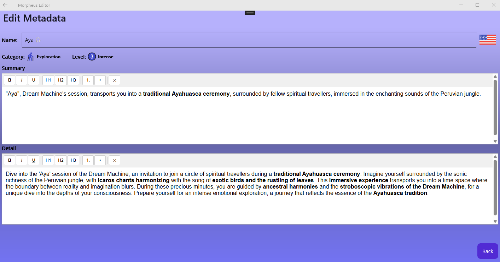

La page d'édition comporte les champs suivants :

- Un premier champ qui permet d'entrer le nom de la séquence dans la langue spécifiée par le drapeau situé à droite.
- À droite de ce champ on trouve un bouton qui permet de sélectionner la langue.
- En dessous on trouve le bouton catégorie qui ouvre une fenêtre contextuelle permettant de sélectionner la catégorie.
- À la suite de ce premier bouton on trouve un 2nd bouton qui ouvre une fenêtre contextuelle permettant de spécifier le niveau de la séquence
- En dessous on trouve un mini éditeur HTML qui permet de rentrer la description résumée. On a une grande fenêtre ou il est possible de taper le texte et au-dessus on trouve 9 boutons qui permettent de formatter le texte :
  - Un texte en gras, en italique, en souligné,
  - Un en tête de niveau 1, 2 , ou 3,
  - Une liste de numéro ou une liste simple
  - La suppression du formatage
- Ensuite on trouve un mini éditeur HTML qui permet de rentrer la description détaillée.

Notez qu'il est nécessaire d'entrer les descriptions résumée et détaillée en français et en anglais

Les modifications sont mémorisées et seront sauvegardées sur disque lorsque vous sauvegarderez la séquence dans la page d'édition.

### Page d'édition de l'audio

Cette page est utilisée pour visualiser les fichiers audio associés à la séquence. Le Morpheus Editor supporte directement les séquences bilingues. Quand on sélectionne une séquence bilingue le simple fait de changer de langue va automatiquement changer les descriptions mais peut également changer automatiquement la piste son associée à la séquence.

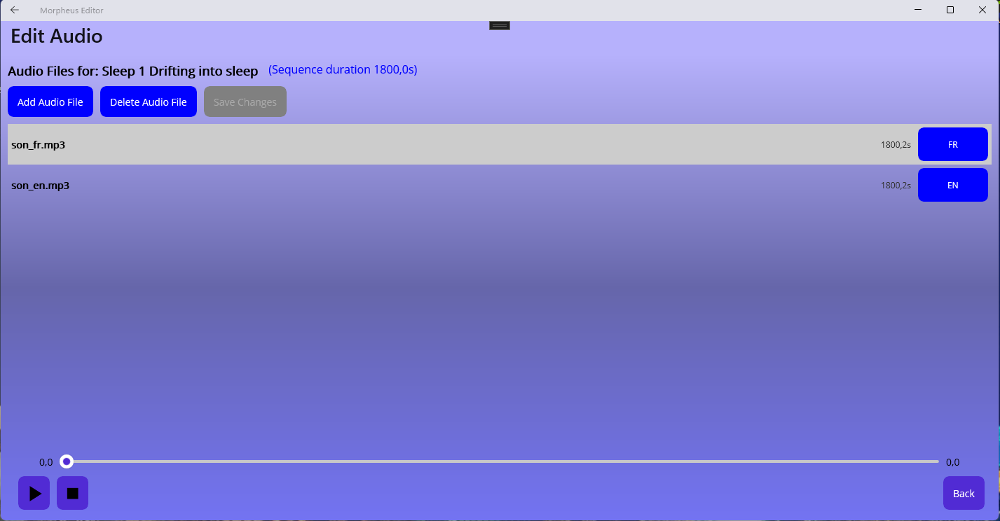

Sur cette page on trouve d'abord un champ qui décrit le nom de la séquence suivi de l'information sur la durée de cette séquence.

On trouve ensuite 3 boutons :

- Le bouton « add audio file » permet d'ajouter une piste son à une séquence. Lorsque l'on clique sur ce bouton une fenêtre contextuelle permet de sélectionner un fichier audio au format mp3. Lorsque la piste audio est ajoutée elle apparaît dans une liste qui indique : le nom du fichier, la durée de cette piste audio, la langue de la piste audio. La langue est à sélectionner parmi les 3 valeurs suivantes : Français, Anglais, ou Neutre (indique une piste son indépendante de la langue, comme de la musique)
- Le bouton « delete audio file » permet de supprimer une piste audio
- Le dernier bouton « save changes » est validé uniquement si des modifications ont été apportées (ajout ou suppression de piste audio) et permet de les sauvegarder.

En bas de la page on trouve un mini lecteur d'audio avec un curseur qui indique la position lorsque l'on est en train d'écouter une piste audio. Et en dessous 2 boutons qui permettent de lancer ou d'arrêter la lecture de la piste audio.

Notez que si vous avez apporté des modifications à la séquence audio et que vous n'avez pas cliqué sur le bouton de sauvegarde une fenêtre contextuelle s'ouvrira automatiquement lorsque vous quitterez la page qui vous demandera si vous voulez conserver ces modifications ou les annuler.

### Page de lecture de séquence

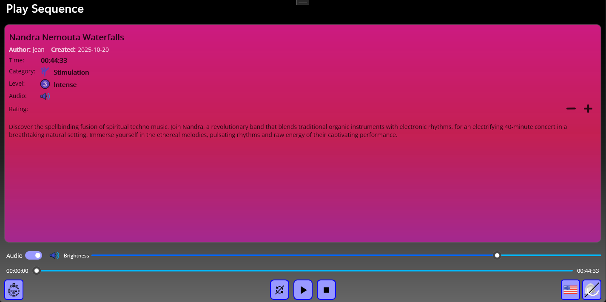

La page comporte une première section de description de la séquence dont la couleur de fond est un dégradé choisi en fonction de la catégorie. Cette description comporte les informations suivantes :

- La **durée** en minutes et secondes
- Le **nom** de la séquence.
- La **catégorie** (Détente, Exploration, Stimulation)
- Le **niveau** (Confortable, Modéré, Intense)
- La **présence d'audio**.
- La **notation utilisateur** (de 0 à 5 étoiles) de la séquence suivie de 2 boutons. Ces boutons vous permettent de modifier cette notation. Si vous voulez augmenter la note appuyez sur le bouton plus, si vous voulez diminuer cette note appuyez sur le bouton moins.
- Une zone de texte qui détaille le contenu de la séquence

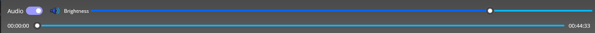

En dessous de cette section on trouve :

- Un commutateur qui vous permet de choisir si vous souhaitez ou non entendre la piste audio.
- Un indicateur qui confirme ce choix
- Un curseur qui permet de régler la **luminosité globale** de la Dream Machine (entre 0 et 100%)
- Un curseur de position qui vous permet soit de visualiser la progression de la lecture dans la séquence, soit de positionner la lecture à n'importe quel endroit de la séquence. En mode lecture, le curseur avance au fur et à mesure, mais vous pouvez cliquer à tout moment n'importe où sur le curseur pour forcer la reprise de la lecture à partir de ce point.

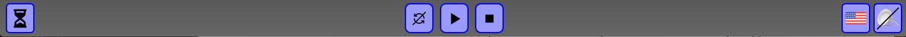

La dernière ligne comporte les boutons et indicateur suivants :

- Le premier bouton permet de sélectionner si l'on veut démarrer la lecture de la séquence immédiatement ou bien si on veut que celle-ci démarre après un délai. Si vous voyez apparaître un sablier cela indique que la séquence démarrera 5 secondes après que vous aurez appuyé sur le bouton play (un décompte des secondes s'affiche alors).
- Le second bouton permet d'indiquer si on veut boucler  la lecture de la séquence ou non . Notez que lorsque l'on est en train d'écouter une playlist le bouton de bouclage permet de passer *automatiquement* d'une séquence à la séquence suivante.
- Puis l'on trouve le bouton **lecture** qui permet de lancer la lecture de la séquence. Dès que la lecture a commencé le bouton **lecture** se transforme en un bouton **pause** qui permet de mettre la séquence en pause. Il est alors possible de reprendre la lecture de la séquence là où elle avait été mise en pause. Mais il est également possible de démarrer ou de reprendre une séquence à n'importe quel endroit que l'on veut en positionnant le curseur de position.
- On trouve ensuite le bouton stop qui arrête la lecture de la séquence et qui repositionne le curseur à zéro.
- On trouve ensuite le bouton de sélection de langue. Si la séquence est bilingue la piste correspondante à la langue sélectionnée sera utilisée. Cela permet de passer rapidement d'une version anglaise à une version française directement depuis la page de lecture.
- On trouve enfin un indicateur de connexion à la Dream Machine. Il est bien sûr recommandé de lancer la lecture lorsque la Dream Machine est connectée mais il est néanmoins possible de lancer la lecture sans connexion auquel cas vous n'aurez évidemment que l'audio.

Lorsque la séquence est en cours de lecture ou en pause la section de description change complètement pour être remplacée par la fenêtre suivante :

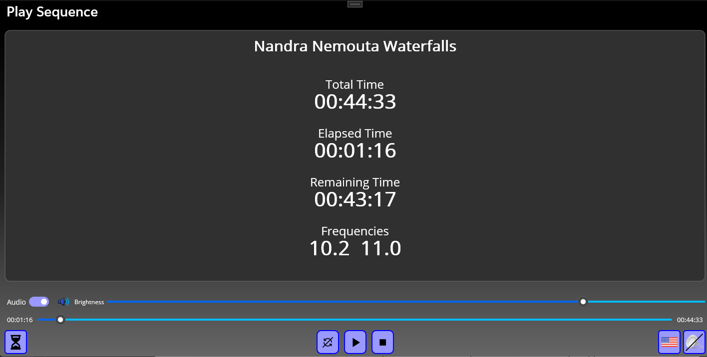

Dans cette section on trouve alors les informations suivantes :

- Le titre de la séquence
- La durée de la séquence
- Le temps écoulé depuis le début de la séquence
- Le temps restant avant la fin de la séquence
- La fréquence utilisée par les différents oscillateurs.

Lorsque vous utilisez vous-même la Dream Machine, ces informations ne présentent que peu d'intérêt, car à ce moment-là, vous avez probablement les yeux fermés. Mais ces informations sont utiles pour un praticien qui mène une séance avec un client.

### Page d'authentification

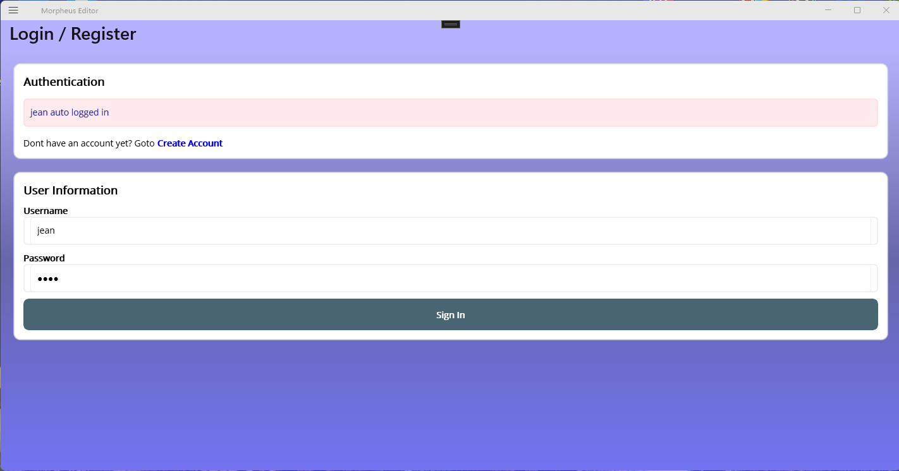

Cette page permet soit de créer un compte sur le serveur web lors de la première utilisation du programme, soit de se connecter à un compte existant. À part lors de la première utilisation où il faut créer son compte l'utilisateur n'a normalement pas besoin de se rendre sur cette page étant donné que la connexion au serveur web se fait automatiquement en tâche de fond sans intervention de l'utilisateur.

### Page de mise à jour des programmes et des séquences

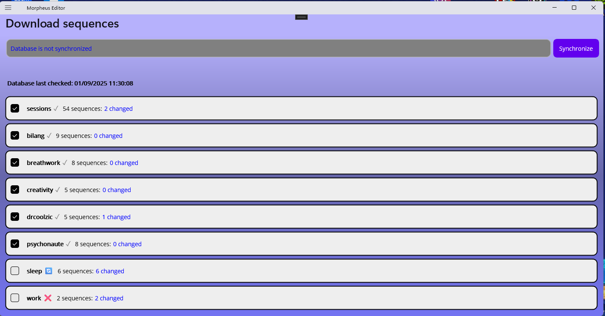

Le projet Morpheus maintient une base de données des différents programmes et séquences sur un serveur internet.

Il est possible à partir de cette page de vérifier si les programmes et les séquences sur votre appareil sont synchronisés avec les dernières mises à jour du serveur Morpheus.

- On trouve un premier champ qui indique si la base de données locale est synchronisée avec la base de données distante
- Ce champ est suivi d'un bouton « synchronize » qui permet de lancer la synchronisation de la base de données locale avec la base de données distante. Comme nous allons le voir ci-dessous seuls les programmes sélectionnés seront mis à jour.
- On trouve ensuite un indicateur qui indique quand la dernière mise à jour a été effectuée
En dessous de ces différents éléments on trouve une liste de tous les **programmes** locaux et distants. Chaque élément de la liste contient les informations suivantes :
- Une case à cocher qui permet d'indiquer si on est intéressé ou non par ce programme. Si cette case est cochée alors lors de la synchronisation les fichiers modifiés dans la base de données distante seront mis à jour (ajout, modification, suppression) dans la base de données locale.
- Le nom du programme
- Un indicateur qui montre si des séquences à l'intérieur de ce programme ont été soit modifiées soit ajoutées soit supprimées
- Cet indicateur est suivi d'une information plus précise sur le nombre de séquences qui ont été modifiées

Morpheus Editor mémorise les programmes qui vous intéressent et donc lorsque vous arrivez sur cette page seront déjà cochés tous les programmes que vous avez précédemment sélectionnés.

Le programme « sessions » est particulier car il est toujours sélectionné. Les programmes non cochés seront ignorés lors de la comparaison des bases de données.

### Page de pilotage en temps réel de la Dream Machine

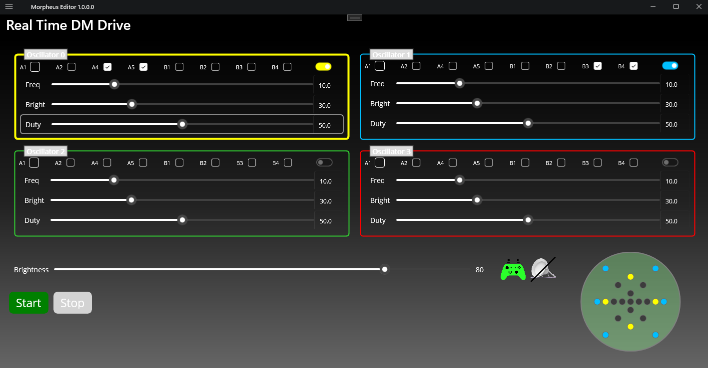{width="6.3in" height="3.28125in"}

Cette page permet de piloter en temps réel la Dream Machine. Ceci est donc très utile lorsque l'on veut tester des fréquences particulières ou des associations d'oscillateur.

La page comporte les champs suivants :

- Les 4 panneaux d'oscillateurs : Chaque panneau présente les sélecteurs de LED de l'oscillateur, trois curseurs (Frequency, Brightness, Duty) et un interrupteur On/Off. Une bordure colorée plus épaisse vous permet de savoir quel oscillateur est actuellement sélectionné. 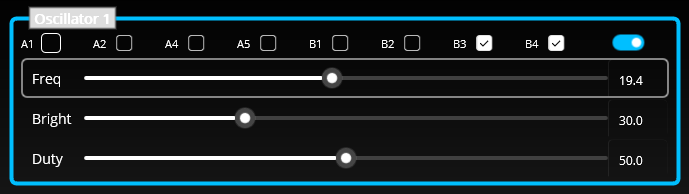
- La barre de status global : Un curseur de luminosité principal, des boutons Démarrer / Arrêter, une icône de connexion à la Dream Machine et une icône de manette de jeu qui devient verte lorsqu'une manette est connectée (rouge non connecté). 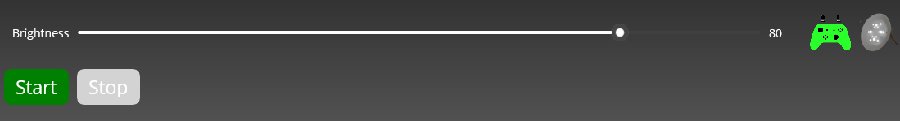
- Le visualiseur de LED : Un cercle de points qui reflète les LED actives. Les LED actives prennent la couleur de l'oscillateur ; les LED inactives sont grises.
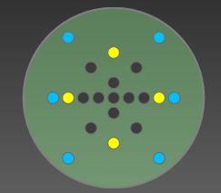

#### Utilisation des commandes du clavier et de la manette de jeu

Vous pouvez tout contrôler à l'aide d'un clavier ou d'une manette de jeu compatible. Le processus vous permet de :

- Sélectionner un oscillateur
- Sélectionner un paramètre
- Régler la valeur

##### Étape 1 : Sélection d'un oscillateur

Utilisez les touches fléchées ou le D-Pad pour vous déplacer de gauche à droite entre les quatre panneaux d'oscillateurs.

- Clavier : Flèche gauche / Flèche droite
- Gamepad : YButton Osc0, BButton Osc1, AButton Osc2, XButton Osc3

La bordure du panneau sélectionné devient plus épaisse pour que vous sachiez toujours lequel est actif.

##### Étape 2 : Sélectionner un paramètre

Une fois qu'un oscillateur est sélectionné, utilisez les flèches haut et bas ou le D-Pad pour choisir le paramètre que vous souhaitez modifier.

- Clavier : Flèche vers le haut / Flèche vers le bas
- Gamepad : DLeft Freq, DUp Bright, DRight Duty, DDown Flip Osc on/off

Le libellé du paramètre sélectionné (`Freq`, `Bright`, ou `Duty`) sera surligné en jaune.

##### Étape 3 : Ajuster la valeur

Avec un oscillateur et un paramètre sélectionné, vous pouvez maintenant modifier sa valeur.

- Clavier : `Page Haut` ou Numpad + (augmentation) / `Page Bas` ou Numpad - (diminution)
- Gamepad : LeftBumper decrease, RightBumper increase

##### Étape 4 : Démarrer / Arrêter

- Gamepad: StartButton start, BackButton: Stop

#### Utilisation de la souris / de l'écran tactile

Bien sûr, vous pouvez toujours utiliser votre souris ou votre écran tactile pour tout contrôler directement :

- Sélectionner l'oscillateur : Cliquez n'importe où dans un panneau.
- Ajuster les paramètres : Utilisez les curseurs ou tapez une valeur directement dans les cases numériques.
- Activer les LEDs : Utilisez les cases à cocher dans chaque panneau.
- Activer l'oscillateur : Basculez l'interrupteur "On/Off".

#### Contrôles globaux

- Curseur de luminosité : Règle la luminosité globale des LED pour tous les oscillateurs.
- Démarrer / Arrêter : Commence ou termine le contrôle en temps réel. Ces boutons doivent être utilisés à l'aide d'une souris ou d'une touche.

#### Indicateurs d'état

- Icône Dream Machine : Indique l'état de la connexion au matériel Dream Machine.
- Icône Gamepad : Rouge lorsqu'aucune manette n'est connectée, vert lorsqu'une manette est connectée.

#### Visualiseur de LED

Le visualiseur se met instantanément à jour chaque fois que vous :

- Basculez la case à cocher d'une diode électroluminescente.
- Activez ou désactivez un oscillateur.

Ses couleurs correspondent aux panneaux de l'oscillateur, ce qui vous permet de voir d'un coup d'œil quelles LED s'allumeront sur l'appareil.

### Page de réglages

Cette fonctionnalité est en cours de développement et sera documentée ultérieurement.
