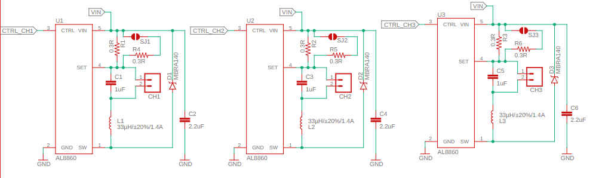
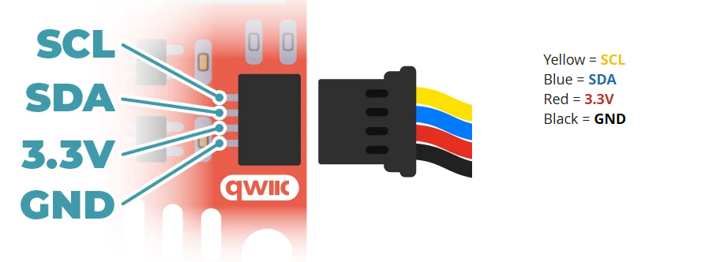
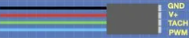
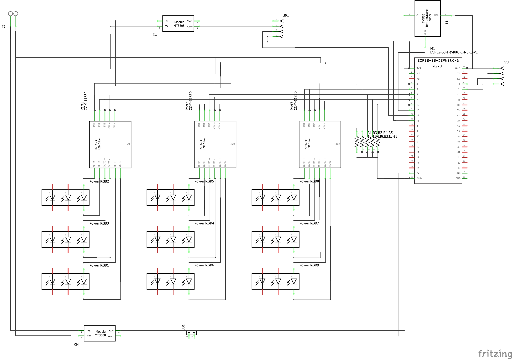
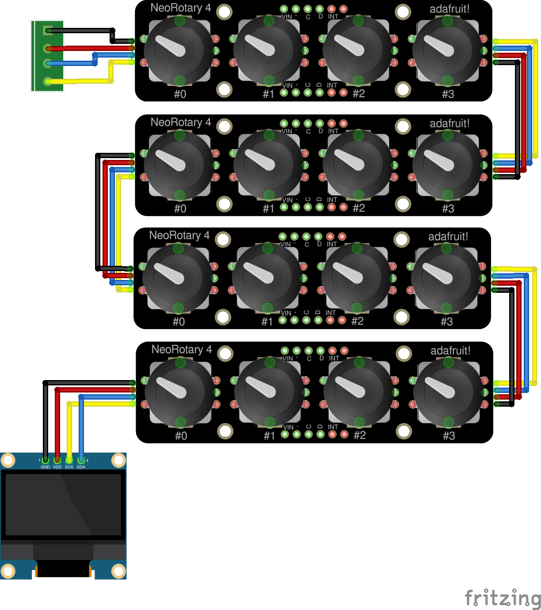

# Hardware Prototype

The prototype is built on a set of boards connected via QWIIC/STEMMA QT cables:

- **Main electronics**: ESP32-S3-DevKitC-1, 3× PicoBuck LED converters, 9 LED groups, temperature sensor, fan, 2× DC-DC converters (for 5V and 12V)
- **Control electronics**: 4× Adafruit NeoRotary 4 (I2C quad rotary encoder + NeoPixel ring), 1× I2C OLED display 128×64 SSD1306

## Components

The components used for the prototype are:

- [ESP32-S3-DevKitC-1 8MB PSRAM 16MB FLASH N16R8 42Pin](https://fr.aliexpress.com/item/1005007173771226.html) development board
- 3× [PicoBuck LED Driver](https://www.sparkfun.com/picobuck-led-driver.html)
- 32× [1W High Power cool white 6500K LED with 20mm star pcb](https://fr.aliexpress.com/item/1005003381591196.html) for the 8 peripheral groups
- 4× [3W High Power warm white LED with 20mm star pcb](https://fr.aliexpress.com/item/1005003381591196.html) for the central group
- [150×150 aluminum plate](https://www.amazon.fr/Plaque-aluminium-5083-150mm/dp/B07NYV688B/ref=sr_1_6?th=1) (or a [150×150×25mm Aluminum Heat Sink radiator](https://fr.aliexpress.com/item/32958588818.html))
- [ARCTIC TP-4 : High Performance Thermal Pad 100×100×0.5 mm](https://www.amazon.fr/ARCTIC-TP-4-thermique-performance-irrégularités/dp/B0FZV47ZNR/ref=sxin_10_pa_sp_search_thematic_sspa?th=1)
- [24V 5A 120W Power Supply](https://www.amazon.fr/Alimentation-Adaptateur-Transformateur-Convertisseur-Surveillance/dp/B0FWRG2X67/ref=sr_1_7?th=1)
- [5A DC-DC Step Down Power Supply Buck Converter](https://fr.aliexpress.com/item/1005005921557535.html) for 5V ESP32 power
- [12V DC-DC Step Down Power Supply Buck Converter](https://fr.aliexpress.com/item/1005010319587802.html) for 12V fan power
- [TMP36 temperature sensor](https://fr.aliexpress.com/item/1005007666012953.html)
- [4-pin SM04B-SRSS-TB connector for QWIIC](https://fr.aliexpress.com/item/1005012597457629.html)
- [2.54 mm KF2510 3+1P KF2510-4AW Male Housing Connector White Straight Pin Header 4pin](https://fr.aliexpress.com/item/1005004714218238.html)
- 4× [Adafruit I2C Quad Rotary Encoder](https://learn.adafruit.com/adafruit-i2c-quad-rotary-encoder-breakout/arduino)
- [I2C OLED Display 128×64 SSD1306](https://fr.aliexpress.com/item/1005011852817482.html)

> **Note:** The PicoBuck uses the AL8805 LED driver, which is functionally equivalent to the AL8860 selected for the final product. The AL8860 is the recommended choice for the final PCB design.
>

## Power Supply

The prototype is powered by a 24V 5A 120W supply:

- 24V is used directly by the PicoBuck LED Buck Converters to power the LEDs.
- A 5V DC-DC buck converter provides power to the ESP32-S3-DevKitC-1.
- A 12V DC-DC buck converter provides power to the PWM fan.

> **Important — Power source conflict:** The ESP32-S3-DevKitC-1 can be powered either from the on-board USB port(s) or from the external `5V` pin, but these two sources are mutually exclusive. If the 5V DC-DC converter is connected to the DevKit `5V` pin while the USB cable is also plugged in, the USB 5V rail and the converter output will be in parallel. Depending on the converter design, this may cause backfeeding and could damage the converter or the USB port.
>
> **Always isolate the 5V DC-DC converter output (e.g., with a jumper) before connecting a USB cable for development.**

## Power Budget

|Component|Power|Notes|
|---------|-----|-----|
|8 peripheral LED groups|~36W|4 × 1W cold white LEDs per group|
|Central LED group|~4.5W|4 × 3W warm white LEDs at ~330mA (default)|
|Central LED group (strap)|~9W|Same LEDs at ~660mA with current-doubling strap|
|LED driver losses|~4W|~10% buck converter losses at full LED power|
|ESP32-S3 + peripherals|~2.5W|Dev board at 5V, ~500mA peak|
|5V buck converter|~0.5W|Conversion losses|
|12V buck converter|~0.5W|Conversion losses for the fan|
|PWM fan|~1W|120mm fan at moderate speed|
|**Total (default)**|**~49W**|Corresponds to ~2.0A at 24V|
|**Total (central strap)**|**~54W**|Corresponds to ~2.3A at 24V|

The 24V / 5A / 120W supply leaves a comfortable margin (about 2.5× the expected maximum load).

## Thermal Considerations

At full brightness, the LEDs dissipate most of their consumed power as heat. The 150×150mm aluminum plate (or optional heatsink) combined with the PWM fan must keep the LED temperature below the rated maximum. The TMP36 temperature sensor located on the aluminum LED plate will increase the fan speed if the temperature exceeds a defined threshold. Exact thermal calculations will depend on the final plate thickness, heatsink choice, and ambient conditions, and will be validated during prototype testing.

## ESP32-S3 Pin selection

The following pins must **not** be used as general-purpose I/O:

- **GPIO0**: Strapping pin — boot mode selection (download vs. normal boot)
- **GPIO3**: Strapping pin — JTAG signal source selection
- **GPIO45**: Strapping pin — VDD_SPI voltage (3.3 V vs 1.8 V for flash/PSRAM)
- **GPIO46**: Strapping pin — ROM serial output enable
- **GPIO19**: USB D- (USB-JTAG); disables USB-JTAG if reconfigured
- **GPIO20**: USB D+ (USB-JTAG); disables USB-JTAG if reconfigured
- **GPIO26–GPIO32**: Reserved for internal SPI0/1 flash — never use
- **GPIO33–GPIO37**: Reserved for Octal flash/PSRAM — **this project uses an ESP32-S3R8 module**, so all five pins are unavailable externally.
- **GPIO43**: UART0 TX (wired to the on-board USB-to-UART bridge CP2102N) — avoid unless UART0 is not needed
- **GPIO44**: UART0 RX (same as above)
- **GPIO48**: On-board addressable RGB LED

> **Note on GPIO39–42:** These are **safe to use** as general-purpose I/O (they are JTAG pins only when the JTAG interface is actively enabled via software/OpenOCD, not by default in application code).

For the prototype we need 10 GPIO pins:

- 4 LEDC/PWM GPIO pins for the signals that control the 4 peripheral banks (PB1-PB4), each containing 2 LED sub-groups: GPIO4, GPIO5, GPIO6, GPIO7
- 1 LEDC/PWM GPIO pin for the signal that controls the central LED group (CG): GPIO15
- 2 I2C GPIO pins for the SDA/SCL signals that go to the QWIIC connector: GPIO1 (SDA), GPIO2 (SCL)
- 1 Analog GPIO pin connected to the TMP36 temperature sensor: GPIO16 (ADC2_CH5)
- 1 GPIO pin for fan tachometer input: GPIO17
- 1 GPIO pin to control the fan PWM: GPIO18

## Prototype wiring

The prototype consists of two electronics assemblies connected via QWIIC/STEMMA QT cables:

- **Main electronics**: ESP32-S3-DevKitC-1, PicoBuck converters, LED star groups, fan, temperature sensor
- **Control electronics**: 4× Adafruit NeoRotary 4 (I2C quad rotary encoder + NeoPixels), 1× I2C OLED display

### Main electronics

**Composed of**:

- An 15x15 cm aluminum plate with
  - [x] 36 (9x4) LEDs mounted with thermal pad
  - [ ] a temperature sensor
  - [x] One 6x9 cm prototype board with
    - [x] An ESP32-S3 devkit,
    - [x] A 5V DC-DC Buck converter
    - [x] A 5V Jumper so the converter can be isolated when a USB cable is plugged in for development
    - [ ] A 12V DC-DC Buck converter
    - [x] A 2 Pin power connector
    - [ ] A 4 pins QWIIC connector
    
    - [ ] A 4 pins PWM fan connector
    
  - [x] Three PicoBuck boards
  - [x] Five 10 kΩ pull-down resistors on the LEDC/PWM control lines

> **Note1**: LED Groups are shown in the schematic as one LED but in fact each group contains 4 LEDs connected in series as shown below

**Wiring**:

- [x] Connect the 24 V power supply to the input of the 3 PicoBuck converter (VIN+ / VIN−) using 18 AWG wires
- [ ] Connect the 24 V power supply to prototype board power connector
- [x] Connect the power connector to the 5V DC-DC converter inputs
- [ ] Connect the power connector to the 12V DC-DC converter inputs
- [x] Connect the 5V DC-DC converter GND output to the GND pins of the ESP32-S3-DevKitC-1
- [x] Connect the 5V DC-DC converter 5V output to the jumper input and the jumper output to the 5V pins of the ESP32-S3-DevKitC-1
- [x] Connect in series the 4 LEDs of each group of LEDs (nine) using 22 AWG wires
- [x] Connect the three outputs of the three PicoBuck the the nine group of LEDs using 22 AWG wires
- [x] Connect the inputs of the PicoBuck to the GPIO pins using 22 AWG wires
  - [x] GPIO4 to PicoBuck_1 IN1 and PicoBuck_2 IN1
  - [x] GPIO5 to PicoBuck_3 IN1 and IN2
  - [x] GPIO6 to PicoBuck_2 IN3 and PicoBuck_3 IN3
  - [x] GPIO7 to PicoBuck_1 IN2 and IN3
  - [x] GPIO15 to PicoBuck_2 IN2
  - [x] Connect one 10 kΩ pull-down resistor from each LEDC/PWM control line (GPIO4, GPIO5, GPIO6, GPIO7, GPIO15) to GND
  - [x] Connect the GND pins of the PicoBuck converters to the GND pin(s) of the ESP32-S3-DevKitC-1

> **PWM safety note:** During ESP32 reset and boot, the LEDC/PWM GPIOs are high impedance until the firmware configures them. The 10 kΩ pull-down resistors hold the PicoBuck inputs low during this interval, preventing an unintended full-brightness flash.

- [ ] For the QWIIC connector: Connect SDA to GPIO1, SCL to GPIO2, VCC to 3.3 V, GND to GND.
- [ ] For the PWM Fan Connector: Connect the 12V DC-DC converter outputs to the V+ and GND pins, TACH pin to GPIO17, PWM pin to GPIO18
- [ ] Connect the temperature sensor power and ground to the 3.3V and GND pins of the ESP32
- [ ] Connect the temperature sensor output to GPIO16

### Control electronics

The Control electronics is a standalone device connected to the Main electronics via a QWIIC/STEMMA QT cable. All components on this device communicate with the ESP32-S3 over the shared I2C bus (GPIO1/GPIO2).

**Components (to be connected in a later prototype phase):**

> **Note:** The NeoRotary encoders and OLED display are not connected in the first hardware bring-up phase. The initial firmware will be controlled and monitored via the serial interface.

**I2C addressing:**

The four NeoRotary 4 boards share the same I2C bus. Each board's address must be unique and set via the address jumpers on the board:

|Board|I2C Address|
|-----|-----------|
|NeoRotary #0|0x49 (default)|
|NeoRotary #1|0x4A|
|NeoRotary #2|0x4B|
|NeoRotary #3|0x4C|
|OLED display|0x3C (typical)|

**Wiring:**

- [ ] Mount the four NeoRotary 4 boards on the Control electronics board.
- [ ] Mount the OLED display on the Control electronics board.
- [ ] Chain all boards via their QWIIC connectors (daisy-chain): Main electronics → NeoRotary #0 → NeoRotary #1 → NeoRotary #2 → NeoRotary #3 → OLED.
- [ ] Set the I2C address jumpers on each NeoRotary 4 board according to the table above.
- [ ] Connect the first QWIIC connector of the chain to the QWIIC connector on the Main electronics.

## Enclosure Prototype

> **Note:** The enclosure will differ between the prototype and the final product.

The main prototype enclosure will be designed to hold the Main electronics, the LED plate, and the cooling fan.
The control enclosure will be designed to hold the Control electronics.

The current plan is to use FreeCAD with MCP to generate the enclosure and drive a 3D printer.

TBD.
