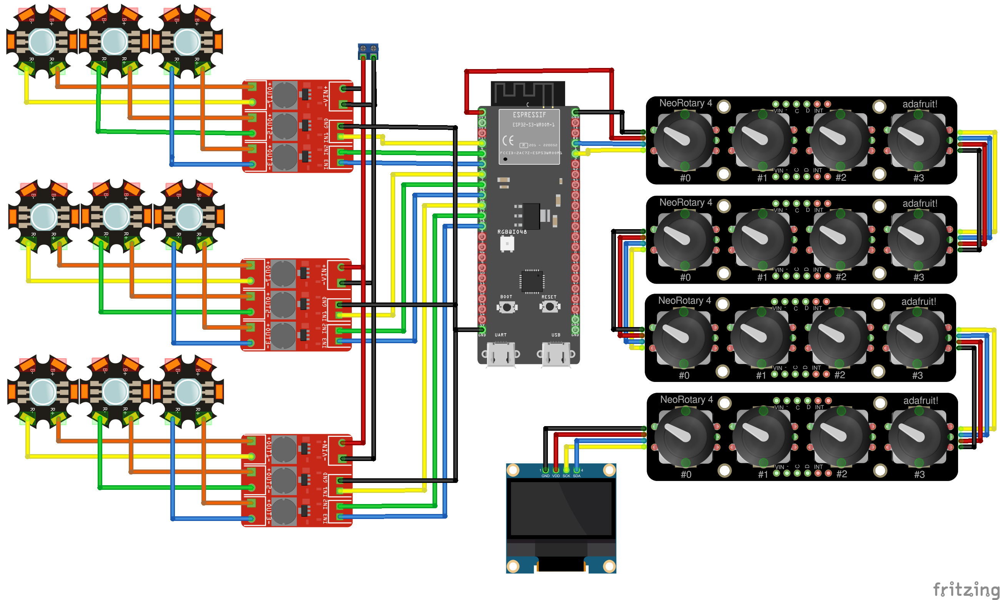

# Hardware Prototype

## ESP32-S3 Pin selection

The following pins must **not** be used as general-purpose I/O:

- **GPIO0**: Strapping pin — boot mode selection (download vs. normal boot)
- **GPIO3**: Strapping pin — JTAG signal source selection
- **GPIO45**: Strapping pin — VDD_SPI voltage (3.3 V vs 1.8 V for flash/PSRAM)
- **GPIO46**: Strapping pin — ROM serial output enable
- **GPIO19**: USB D- (USB-JTAG); disables USB-JTAG if reconfigured
- **GPIO20**: USB D+ (USB-JTAG); disables USB-JTAG if reconfigured
- **GPIO26–GPIO32**: Reserved for internal SPI0/1 flash — never use
- **GPIO33–GPIO37**: Reserved for Octal flash/PSRAM — **this project uses an ESP32-S3R8 module**, so all five pins are unavailable externally.
- **GPIO43**: UART0 TX (wired to the on-board USB-to-UART bridge CP2102N) — avoid unless UART0 is not needed
- **GPIO44**: UART0 RX (same as above)
- **GPIO48**: On-board addressable RGB LED

> **Note on GPIO39–42:** These are **safe to use** as general-purpose I/O (they are JTAG pins only when the JTAG interface is actively enabled via software/OpenOCD, not by default in application code).

For the prototype we need 14 GPIO pins:

- 8 LEDC/PWM GPIO pins for the signals that control the 8 LED outer groups (OG1-OG8): GPIO4, GPIO5, GPIO6, GPIO7, GPIO16, GPIO17, GPIO18, GPIO8
- 1 SDM GPIO pin for the signal that controls the LED center group (CG): GPIO15
- 2 I2C GPIO pins for the SDA/SCL signals that go to the QWIIC connector: GPIO1 (SDA), GPIO2 (SCL)
- 1 Analog GPIO pin connected to the TMP36 temperature sensor: GPIO9 (ADC1_CH8)
- 1 GPIO pin for fan tachometer input: GPIO10
- 1 GPIO pin to control the fan PWM: GPIO11

## Prototype wiring

The prototype consists of two boards connected via QWIIC/STEMMA QT cables:

- **Main Board**: ESP32-S3-DevKitC-1, PicoBuck converters, LED star groups, fan, temperature sensor
- **Control Board**: 4× Adafruit NeoRotary 4 (I2C quad rotary encoder + NeoPixels), 1× I2C OLED display

> **Note1:** Fan wiring is not yet shown in the schematic.
>
> **Note2**: LED Groups are are shown in the schematic as one LED but in fact each group contains 4 LED connected in series as shown below

### Main Board

**Power supply:**

- [ ] Connect the 24 V power supply to the input of each PicoBuck converter (VIN+ / VIN−).
- [ ] Connect GND of the 24 V supply to the GND rail of the prototype board.
- [ ] Power the ESP32-S3-DevKitC-1 via its `UART` USB port during development, or via the 5 V / 3.3 V header pins in the final prototype.

**PicoBuck converters (×3):**

- [ ] Mount the three PicoBuck converters on the prototype board.
- [ ] Connect each PicoBuck output (VOUT+ / VOUT−) to the corresponding LED star group pair.
- [ ] Connect each PicoBuck DIM pin to the corresponding ESP32-S3 GPIO (LEDC/PWM):
  - PicoBuck 1 → GPIO4 (OG1), GPIO5 (OG2), GPIO6 (OG3)
  - PicoBuck 2 → GPIO7 (OG4), GPIO15 (CG), GPIO16 (OG5)
  - PicoBuck 3 → GPIO17 (OG6), GPIO18 (OG7), GPIO8 (OG8)

**LED star groups:**

- [ ] Connect each LED star group anode (+) to the corresponding PicoBuck output VOUT+.
- [ ] Connect all LED star group cathodes (−) to GND.

**Temperature sensor (TMP36):**

- [ ] Connect TMP36 VCC to 3.3 V.
- [ ] Connect TMP36 GND to GND.
- [ ] Connect TMP36 VOUT to GPIO9 (ADC1_CH8).

**QWIIC connector (I2C to Control Board):**

- [ ] Solder a QWIIC connector to the prototype board.
- [ ] Connect SDA to GPIO1, SCL to GPIO2, VCC to 3.3 V, GND to GND.

**Fan (TBD):**

- [ ] Connect fan tachometer output to GPIO10.
- [ ] Connect fan PWM control input to GPIO11.

### Control Board

The Control Board is a standalone board connected to the Main Board via a QWIIC/STEMMA QT cable. All components on this board communicate with the ESP32-S3 over the shared I2C bus (GPIO1/GPIO2).

**Components:**

- 4× [Adafruit NeoRotary 4](https://www.adafruit.com/product/5752) — I2C quad rotary encoder with NeoPixel ring (seesaw-based, each has a configurable I2C address)
- 1× I2C OLED display (SSD1306 or equivalent, 128×64)

**I2C addressing:**

The four NeoRotary 4 boards share the same I2C bus. Each board's address must be unique and set via the address jumpers on the board:

|Board|I2C Address|
|-----|-----------|
|NeoRotary #0|0x49 (default)|
|NeoRotary #1|0x4A|
|NeoRotary #2|0x4B|
|NeoRotary #3|0x4C|
|OLED display|0x3C (typical)|

**Wiring:**

- [ ] Mount the four NeoRotary 4 boards on the Control Board.
- [ ] Mount the OLED display on the Control Board.
- [ ] Chain all boards via their QWIIC connectors (daisy-chain): Main Board → NeoRotary #0 → NeoRotary #1 → NeoRotary #2 → NeoRotary #3 → OLED.
- [ ] Set the I2C address jumpers on each NeoRotary 4 board according to the table above.
- [ ] Connect the first QWIIC connector of the chain to the QWIIC connector on the Main Board.
