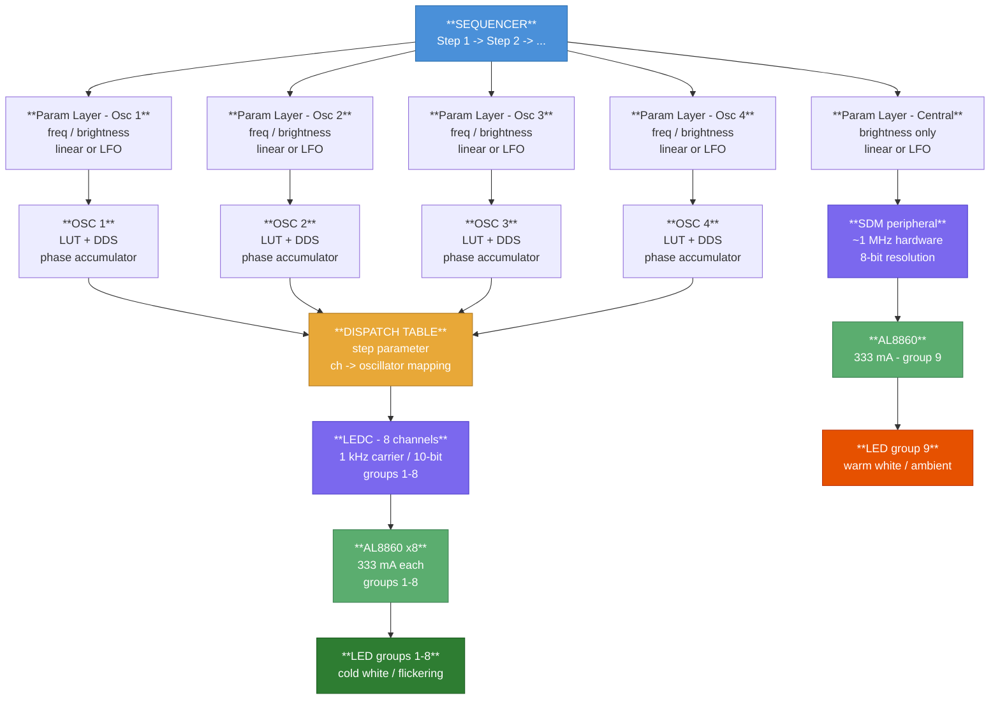

# Morpheus HypnoLight Project

## Objective

The objective of this project is to create a device for visual and auditory stimulation. This type of device is often referred to as FLS (Flicker Light Stimulation) or AVS (Audio-Visual Stimulation). Flicker Light Stimulation (FLS) is a non-invasive technique that uses rhythmic light variation to influence brain activity and the state of consciousness. It involves emitting rhythmic light pulses at specific frequencies, typically ranging from 3 Hz to 50 Hz. These light pulses stimulate the visual system, leading to a phenomenon called "visual entrainment," in which brain activity synchronizes with the frequency of the light. This synchronization can induce altered states of consciousness, like those experienced during deep meditation or under the influence of psychedelics, often accompanied by striking visual patterns and sensations beyond conscious control.

---

## Main Features

### Must have (V1)

- **Remote Sequence Mode of Operation**: The sequences to play are selected and controlled remotely from an application that communicates using BLE or Wi-Fi. This application can control multiple machines simultaneously.
- **Remote Real-time Mode of Operation**: Developers use this mode to control all machine parameters in real time without using sequences.
- Bluetooth Low Energy connectivity, used to connect to the control application and potentially to a sound system
- 8 outer LED groups (cold white) driven by 4 independent oscillators via 8 LEDC hardware channels
- 1 central LED group (warm white) driven by a dedicated Sigma-Delta Modulator (SDM) channel with linear or LFO brightness control
- 4 oscillators with sine, triangle, square, and custom waveforms, each with controllable frequency, duty cycle, brightness, and phase
- Per-step oscillator-to-group assignment (each step can route oscillators to different LED groups)
- Low Frequency Oscillator (LFO) modulation of oscillator parameters, including frequency modulation for rich FLS effects
- Step-based sequence engine with linear interpolation and LFO modulation modes
- Capability to pause and seek loaded sequences
- Low-cost hardware (target: under $100)
- Low-noise (large PWM-controlled fan)
- Compact and easy to carry with tripod mounting threads
- WiFi web server interface

### Could have (V2)

- **Local Sequence Mode of Operation**: Sequence selection and control is done locally, without the need for an external application. The sequences are stored locally on an SD card, and control is done using knobs, the touch screen, etc.
- **Local Real-Time Mode of Operation**: This mode allows developers to control all machine parameters in real time without using sequences. In Sequence mode, control is done using knobs, the touch screen, etc.
- Input devices: parameter controller (rotary knobs and switches), joystick, mouse, Touch screen
- Output devices: sound output direct through plug or remote via BLE
- Store sequences locally on SD card

---

## LED PCB

The LEDs are placed on a front panel PCB with an aluminum substrate for heat dissipation. In addition to the LEDs, the PCB contains temperature sensors that automatically activate the fan if the device overheats.

Numerous experiments have shown that the position of the LEDs on the PCB has no effect on the user's perception. For instance, a diode that lights up in the top left or bottom right corner of the board is perceived by the user in exactly the same way. Consequently, the LEDs have been arranged into nine groups of four as follows:


The eight peripheral groups are connected to four oscillators, each of which has adjustable frequency, brightness, and duty cycle settings. We use cold white LEDs with a power rating of approximately one watt each. Therefore, each group can provide a maximum power output of four watts, for a total output of about 32 watts for all eight groups combined.

The central group (group 9) uses warm white LEDs (potentially with a power of two watts), and serves a different purpose than the outer groups (groups 1-8). It provides ambient background light without flickering. Its brightness can be smoothly varied over time, though it is not driven by an oscillator.

---

## LED Control Architecture

### Overview

The device drives 9 LED groups using two distinct control paths:

- **Groups 1-8 (cold white, outer ring)**: driven by the 4 independent software oscillators via the 8 LEDC hardware channels of the ESP32-S3. Each group produces a flickering light signal with fully controllable frequency, duty cycle, brightness, and phase.

- **Group 9 (warm white, central)**: driven by a dedicated Sigma-Delta Modulator (SDM) hardware channel. It does not flicker; its brightness is controlled smoothly via linear interpolation or LFO modulation.

The 4 oscillators produce signal values that are dispatched to the 8 LEDC channels via a **dispatch table**, which is a step-level parameter: each step defines which oscillator drives which groups.

A given LED group can be driven by at most one oscillator at a time. Unassigned groups remain off for the duration of the step.

---

### LED Driver

After examining several LED drivers, the AL8860 was chosen as it perfectly suits the project's needs. With the AL8860, the brightness of the connected LEDs can be controlled either with an analog or a PWM signal.

Using the analog control input of the AL8860 has serious limitations:

- **Limited range**: only 0.5 V to 2.5 V
- **Potential nonlinearity**
- **Additional complexity** requiring D/A converters

Therefore, brightness is controlled by pulse width modulation (PWM) applied to the CTRL pin of the AL8860. The same AL8860 circuit is used for all 9 groups, including the central group; only the signal source differs.

The schematic for one LED group is as follows:


The AL8860 is a buck (step-down) constant-current LED driver. Its role is to regulate the current through the LEDs at a fixed value determined by the sense resistor R1. With R1 = 300 mOhm, the regulated LED current is:

$$I_{LED} = \frac{V_{SET}}{R_1} = \frac{0.1\,V}{0.300\,\Omega} \approx 333\,mA$$

The 4 LEDs in each group are connected in series, giving a total forward voltage of approximately 13.6 V (4 x 3.4 V). The driver circuit is powered by a 24 V supply, which provides a comfortable margin.

The CTRL pin of the AL8860 operates in digital mode:

- **CTRL > 2.5 V**: driver active, regulated current flows through LEDs
- **CTRL < 0.4 V**: driver shut down, LED off

This makes the CTRL pin ideal for direct connection to a PWM signal generated by the ESP32, through a 1 kOhm series resistor (R2) for protection.

---

### LED Control: Outer Groups (1-8)

#### Two-Level PWM Modulation

The oscillator parameters are: frequency (1-100 Hz), duty cycle (0-100%), brightness (0-100%), and phase (0-360 degrees).

Since the signal driving the AL8860 CTRL pin must be a digital PWM signal, a two-level **PWM modulation** technique is used to independently control both brightness and the visible flicker frequency and duty cycle:

- **Carrier signal**: High-frequency PWM (1 kHz), generated by the ESP32 LEDC hardware peripheral, controls the LED brightness via its duty cycle.
- **Modulating signal**: Low-frequency waveform (1-100 Hz), generated in ESP32 software, creates the visible flashing effect. Its frequency and duty cycle determine the flicker parameters.

The two levels are combined as follows:

```text
final_duty = osc_value(t) * brightness
ledcWrite(channel, final_duty)
```

When `osc_value` is at its peak, the LEDC runs at full brightness duty cycle. When `osc_value` is zero, the LEDC output is zero and the LED is off. This gives fully independent control of all three parameters.


#### Brightness Modulator: ESP32 LEDC Peripheral

The ESP32-S3 LEDC peripheral provides exactly 8 independent hardware PWM channels, one per outer LED group. Each channel is initialized at a fixed carrier frequency (1 kHz) with 10-bit resolution (0-1023 duty range).

Brightness is set by calling `ledcWrite(channel, duty)` where `duty` is proportional to the desired brightness level. Since the carrier frequency (1 kHz) is well above the flicker range and above the threshold of visual persistence, it is invisible to the eye: only the average brightness is perceived.

#### Frequency Generator: ESP32 Software Oscillator

The low-frequency modulating signal is generated entirely in ESP32 software using a high-precision hardware timer (`esp_timer`), which provides microsecond-level accuracy independent of the FreeRTOS task scheduler.

**Waveform shapes supported:**

All waveforms are normalized to the range 0.0-1.0. Each waveform has a **frequency** and a **duty cycle** parameter. The meaning of duty cycle depends on the waveform type:

| Waveform | Duty Cycle Meaning | FLS Effect |
| -------- | ------------------ | ---------- |
| Square | Fraction of period at HIGH level (classic PWM) | Sharp, stroboscopic pulses |
| Triangle | Fraction of period in ascending phase (0% or 100% gives a sawtooth variant) | Linear fade in/out, asymmetry controllable |
| Sine | Not applicable (fixed shape) | Gentle, organic stimulation |
| Custom | Encoded in the LUT (user-defined shape) | Any specific FLS therapeutic profile |

Note: sawtooth is not a separate waveform type. It is a degenerate case of the triangle waveform obtained by setting duty cycle to 0% (instant rise then full fall ramp) or 100% (full rise ramp then instant fall).

**Implementation: LUT + Phase Accumulator (DDS)**

Waveform shapes are pre-computed at step startup into a **Look-Up Table (LUT)** of N samples (e.g., N = 64). This avoids expensive floating-point trigonometric calculations inside the time-critical timer callback. The duty cycle parameter is applied during LUT generation, so changing the duty cycle triggers a LUT rebuild for that oscillator.

To handle continuously changing frequencies smoothly, a **Direct Digital Synthesis (DDS)** phase accumulator is used. Rather than stepping through the LUT at a fixed integer rate, a fractional phase value advances by an amount proportional to the current frequency on every timer tick:

```c
// Timer callback - runs at CALLBACK_RATE Hz (e.g. 1000 Hz)
void osc_callback(void* arg) {
    // 1. Compute all 4 oscillator values
    for (int i = 0; i < NUM_OSC; i++) {
        osc_phase[i] += (LUT_SIZE * current_freq[i]) / CALLBACK_RATE_HZ;
        if (osc_phase[i] >= LUT_SIZE) osc_phase[i] -= LUT_SIZE;
        osc_value[i] = lut[i][(int)osc_phase[i]];
    }

    // 2. Dispatch to LEDC channels (groups 1-8) via dispatch table
    for (int ch = 0; ch < 8; ch++) {
        int osc_id = dispatch_table[ch];
        if (osc_id < 0) { ledcWrite(ch, 0); continue; }  // unassigned -> off
        ledcWrite(ch, (int)(osc_value[osc_id] * current_brightness[osc_id] * MAX_DUTY));
    }
    // Group 9 (central) is handled independently by the SDM peripheral
}
```

This approach ensures:

- Frequency changes are **instantaneous and glitch-free** for all 4 oscillators
- Any waveform shape is supported by simply loading a different LUT
- The dispatch is a cheap integer lookup per channel per tick
- Custom therapeutic waveform profiles can be loaded as arbitrary LUTs

**Parameter update constraints:**

| Parameter | Dynamic during step? | Mechanism |
| --------- | -------------------- | --------- |
| Frequency | Yes | DDS phase increment updated each parameter tick |
| Brightness | Yes | Multiplied at callback time, no LUT rebuild |
| Duty cycle | No (fixed per step) | LUT rebuilt once at step start |
| Phase | Set once at step start | Initializes the phase accumulator |
| Group assignment | Set once at step start | Updates the dispatch table |

Duty cycle is kept fixed per step because changing it requires rebuilding the LUT. For FLS purposes this is not a limitation: the perceptual difference between smoothly swept duty cycle and step-wise updated duty cycle is negligible.

This **phase** is particularly useful when multiple oscillators are used, as it allows you to adjust the relative positions of the waveforms.

**Note on timing constraints:** The LEDC peripheral applies a new duty cycle at the start of each carrier period. At a 1 kHz carrier, updates more frequent than every 1 ms provide no additional benefit. In practice, with a 64-sample LUT, the maximum meaningful flicker frequency is approximately 1000 / 64 = 15 Hz at full waveform resolution. At higher flicker frequencies, a smaller LUT (e.g., 32 or 16 samples) should be used to stay within this constraint.

---

### LED Control: Central Group (Group 9)

#### Role and Constraints

The central group uses warm white LEDs and acts as a background ambient light source. It does not flicker and is never driven by one of the 4 main oscillators. Its only controllable parameter is **brightness**, which can evolve smoothly over the duration of a step using either linear interpolation or LFO modulation.

#### Hardware: Sigma-Delta Modulator (SDM)

The ESP32-S3 Sigma-Delta Modulator (SDM) peripheral is used to drive the central group's AL8860 CTRL pin. The SDM generates a high-frequency 1-bit pulse-density stream (internal clock ~1 MHz) whose average density corresponds to the desired duty cycle. This gives:

- **Zero callback overhead**: the SDM hardware runs autonomously, no timer interrupt needed
- **8-bit resolution**: 256 brightness levels
- **Effective carrier ~78 kHz**: completely invisible, no risk of flicker artifact
- **Simple API**: a single function call sets the brightness

```c
// One-time setup
sdm_channel_handle_t sdm_chan;
sdm_config_t config = {
    .clk_src   = SDM_CLK_SRC_DEFAULT,
    .gpio_num  = CENTRAL_LED_GPIO,
    .sample_rate_hz = 1000000,
};
sdm_new_channel(&config, &sdm_chan);
sdm_channel_enable(sdm_chan);

// Update brightness from parameter layer (every 10-50 ms)
// density range: -128 (off) to +127 (full brightness)
int8_t density = (int8_t)(central_brightness * 255 - 128);
sdm_channel_set_pulse_density(sdm_chan, density);
```

#### Brightness Control Modes

The central brightness is updated by the **parameter layer** every 10-50 ms, independently of the oscillator callback. It supports the same two control modes as the main oscillators:

```c
// Parameter layer tick
if (central_mode == LINEAR) {
    central_brightness = start_b + (end_b - start_b) * (elapsed / duration);
}
else if (central_mode == LFO) {
    float lfo_val  = evaluate_lfo(lfo_form, lfo_freq, t);  // 0.0 to 1.0
    central_brightness = b_min + (b_max - b_min) * lfo_val;
}
sdm_channel_set_pulse_density(sdm_chan, brightness_to_density(central_brightness));
```

Example: a 5 Hz sine LFO between 30% and 50% brightness produces a gentle, slow breathing effect on the warm central light, updated at 100 Hz (every 10 ms = 20 samples per LFO period), giving a visually smooth curve.

---

## Sequence Mode of Operation

### Overview

In normal mode of operation, the device is controlled by playing **sequences** composed of ordered **steps**. Each step has a fixed duration and defines, for each of the 4 oscillators, both the waveform parameters and the oscillator-to-group routing, as well as the brightness of the central group. Steps are played back one after another, with optional looping, pause, and seek capabilities.

### Step Definition

A step has one global parameter, a set of per-oscillator parameters for groups 1-8, and a dedicated parameter block for the central group:

**Global parameter:**

| Parameter | Description |
| --------- | ----------- |
| `duration` | Duration of the step in seconds, common to all oscillators |

**Per-oscillator parameters (repeated for oscillators 1 to 4), groups 1-8 only:**

| Parameter | Description |
| --------- | ----------- |
| `groups` | List of LED groups (1-8) driven by this oscillator during this step |
| `waveform` | Waveform shape: sine, square, triangle, or custom |
| `duty` | Duty cycle: fixed value for the duration of the step (triggers LUT rebuild at step start) |
| `phase` | Starting position in the LUT at the beginning of this step (0-360 degrees) |
| `freq` | Frequency control: linear(start_hz, end_hz) or lfo(form, freq_hz, min_hz, max_hz) |
| `brightness` | Brightness control: linear(start_%, end_%) or lfo(form, freq_hz, min_%, max_%) |

**Central group parameters (group 9, always present):**

| Parameter | Description |
| --------- | ----------- |
| `central_brightness` | Brightness control: linear(start_%, end_%) or lfo(form, freq_hz, min_%, max_%) |

### Parameter Control Modes

The two dynamic parameters for the oscillators (freq and brightness) and the central brightness can independently use one of two control modes during a step:

#### Linear Mode

The parameter interpolates smoothly and linearly from a start value to an end value over the duration of the step. Setting start and end to the same value keeps the parameter constant.

```text
Example step - oscillator 1:
  groups:     1, 5, 7
  duration:   20 s
  waveform:   sine
  duty:       50%
  phase:      0 degrees
  freq:       linear  10 Hz -> 12 Hz
  brightness: linear  80%   -> 50%

Central group:
  central_brightness: linear  40% -> 40%   (constant)
```

At each parameter update tick, the current value is:

```text
current_value = start + (end - start) * (elapsed / duration)
```

#### LFO Mode (Low Frequency Oscillator Modulation)

Inspired by classic analog synthesizers (e.g., Korg MS-20/MS-50), a dedicated **Low Frequency Oscillator (LFO)** modulates the parameter rhythmically between a minimum and maximum value at a given LFO frequency and waveform shape. This creates organic, evolving parameter motion within a step.

```text
Example step - oscillator 2:
  groups:     2, 4, 6
  duration:   10 s
  waveform:   sine
  duty:       50%
  phase:      90 degrees
  freq:       lfo  sine  2 Hz  10 Hz - 20 Hz
  brightness: lfo  triangle  0.5 Hz  60% - 90%

Central group:
  central_brightness: lfo  sine  5 Hz  30% - 50%
```

At each parameter update tick, the LFO value is evaluated and mapped to the parameter range:

```text
lfo_value     = evaluate_lfo(lfo_waveform, lfo_freq, t)   // 0.0 to 1.0
current_value = param_min + (param_max - param_min) * lfo_value
```

**Frequency Modulation and its FLS effect:**

When the LFO is applied to the frequency parameter, the result is a **frequency-modulated (FM) flicker signal**: the visible flicker rate itself oscillates rhythmically between two values. This produces a rich, continuously varying stimulation that differs markedly from a fixed-frequency flash. The perceived effect is a "breathing" or "pulsating" quality to the light, and the range and speed of frequency modulation give precise control over the intensity of this effect. Narrow LFO ranges (e.g., 10-12 Hz) produce subtle vibrato-like variation; wide ranges (e.g., 5-30 Hz) produce dramatic sweeping effects that cross multiple brainwave frequency bands within a single step.

### Sequence Architecture

The full signal flow from the sequence engine down to all LED groups is:



### Timing Layers Summary

| Layer | Update Rate | Responsibility |
| ----- | ----------- | -------------- |
| Sequencer | Every few seconds | Advance to next step, rebuild LUTs, update dispatch table |
| Parameter layer | Every 10-50 ms | Linear interp or LFO update for all oscillators and central group |
| Phase accumulator | Every 1 ms (timer callback) | Drive all 4 oscillators, dispatch to 8 LEDC channels |
| LEDC peripheral | Every 1 ms (carrier period) | Output PWM to AL8860 channels 1-8 |
| SDM peripheral | Autonomous (~1 MHz) | Output pulse-density signal to AL8860 channel 9 |

## Real-Time Mode of Operation

In real-time mode, the notion of steps does not exist as it does in sequence mode. Therefore, the linear mode of the oscillator is replaced by a fixed-value mode.

### Parameter Control Modes

The two dynamic parameters for the oscillators (freq and brightness) and the central brightness can independently use one of two control modes:

#### Fix value Mode

The parameters stay constant.

```text
Example step - oscillator 1:
  groups:     1, 5, 7
  waveform:   sine
  duty:       50%
  phase:      0 degrees
  freq:       linear  10 Hz
  brightness: linear  80%

Central group:
  central_brightness: 40%
```

#### LFO Mode (Low Frequency Oscillator Modulation)

Works as described in the `Sequence mode`

```text
Example step - oscillator 2:
  groups:     2, 4, 6
  waveform:   sine
  duty:       50%
  phase:      90 degrees
  freq:       lfo  sine  2 Hz  10 Hz - 20 Hz
  brightness: lfo  triangle  0.5 Hz  60% - 90%

Central group:
  central_brightness: lfo  sine  5 Hz  30% - 50%
```
