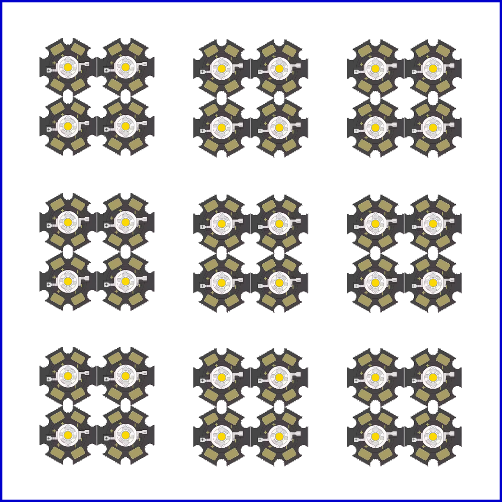
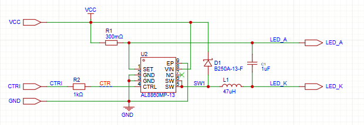
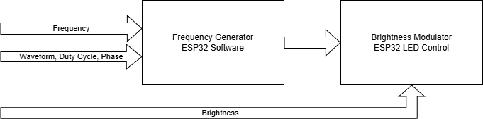
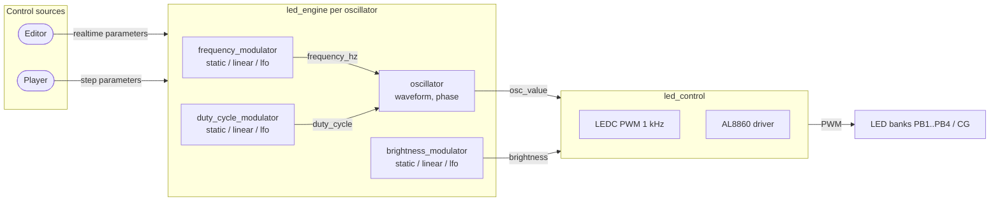

# Morpheus HypnoLight Device

## Objective

The Morpheus HypnoLight Project is an ecosystem consisting of three main components: the Morpheus Player, the Morpheus Editor, and the Morpheus HypnoLight Device.
The objective of this project is to create an environment for visual and auditory stimulation often referred to as AVS (Audio-Visual Stimulation) or FLS (Flicker Light Stimulation).
Flicker Light Stimulation is a non-invasive technique that uses rhythmic light variation to influence brain activity and the state of consciousness.
It involves emitting rhythmic light pulses at specific frequencies, typically ranging from 3 Hz to 50 Hz.
These light pulses stimulate the visual system, leading to a phenomenon called "visual entrainment," in which brain activity synchronizes with the frequency of the light.
This synchronization can induce altered states of consciousness, like those experienced during deep meditation or under the influence of psychedelics, often accompanied by striking visual patterns and sensations beyond conscious control.

A stimulation session consists of both an acoustic component and a visual component.
The audio component is handled by the Morpheus Player / Editor, and the visual component is handled by the Morpheus HypnoLight device.

This specification describes the Morpheus HypnoLight Device, which generates light flashes controlled by the Morpheus Player or the Morpheus Editor.

## Operating Modes

The Morpheus HypnoLight Device can be controlled by two host applications, each corresponding to a distinct operating mode:

**Player Mode**

When controlled by the Morpheus Player, the device behaves like a video player: it loads and plays a sequence made of steps. Playback follows the timing defined in the sequence, and the Player handles the audio locally while sending the necessary timing and parameter data to the HypnoLight device. When playback is paused, the LEDs turn off. This mode is intended for end users who are not concerned with the internal content of the sequence.

**Editor Mode**

When controlled by the Morpheus Editor, the device supports both sequence playback and realtime editing. While a sequence is playing, the behavior is similar to Player mode. When the Editor is paused, playback stops and the current LED state is frozen (the LEDs remain on). The user then enters a realtime editing state in which any parameter — such as oscillator frequency, waveform, duty cycle, phase, or brightness — can be modified directly, for example through potentiometers or on-screen controls. Changes are applied immediately and are reflected on the LEDs in real time. This mode is intended for users who create and edit sequences and therefore need a detailed understanding of how the Morpheus HypnoLight device works.

---

## Main Features

- Two modes of operation as described above
- Bluetooth Low Energy connectivity, used to connect to the control applications and potentially to a sound system
- 4 peripheral LED banks (PB1..PB4, cold white), each containing 2 sub-groups of 4 LEDs and driven by one of 4 LEDC hardware channels
- 1 central LED group (CG, warm white) driven by a dedicated LEDC hardware channel
- 5 oscillators with sine, triangle, square, and custom waveforms, each with controllable frequency, duty cycle, brightness, and phase; oscillators 1-4 drive banks PB1-PB4 and oscillator 5 drives the central group CG
- Generic modulator for frequency, brightness, and duty cycle with static, linear, and simple LFO modes
- Step-based sequence engine with modulator-based frequency, brightness, and duty cycle control
- Capability to freely pause and seek loaded sequences
- A gamma correction is applied to compensate for the fact that the brightness perceived by the human eye follows the Weber–Fechner law, making variations in brightness appear linear.
- Low-cost hardware (target: under $100)
- Low-noise cooling using a large PWM temperature controlled fan
- Compact and easy to carry with [tripod mounting threads](https://www.amazon.fr/ruthex-Lot-pannes-%C3%A0-souder/dp/B0F1B8GC7Z?th=1) - [Hexagonal Insert for Tripod Mounting](https://www.amazon.fr/QUARKZMAN-Entra%C3%AEnement-Hexagonal-Connecteur-Fixation/dp/B0G138HB36/ref=sr_1_49_sspa)
- WiFi web server interface

---

## LED PCB

The LEDs are placed on a front panel PCB with an aluminum substrate for heat dissipation. In addition to the LEDs, the PCB contains temperature sensors that automatically activate the fan if the device overheats.

Numerous experiments have shown that the position of the LEDs on the PCB has no effect on the user's perception. For instance, a diode that lights up in the top left or bottom right corner of the board is perceived by the user in exactly the same way. Consequently, the LEDs have been arranged into four peripheral banks (PB1..PB4) plus one central group (CG), with each bank containing two sub-groups of four LEDs each:



The four peripheral banks are connected to four oscillators, each of which has adjustable frequency, brightness, and duty cycle settings. They use cold **white** LEDs with a power rating of approximately one watt each (with a current of about 330 mA). Therefore, each sub-group driven with a current of 330 mA can provide a maximum power output of 4.5 watts, for a total output of about 36 watts for all eight sub-groups combined.

The central group uses four **warm** white LEDs rated at 3 W each but driven at about 2W (with a current of about 660 mA). Therefore, the central group can provide a maximum power output of 9 watts,

---

## LED Control Architecture

### Overview

The device drives 9 physical LED driver channels (eight peripheral sub-groups and the central group) using a single control path:

- **5 software oscillators** drive 5 LEDC hardware channels of the ESP32-S3.
- **Oscillators 1-4** drive the 4 peripheral banks (PB1..PB4). Each LEDC channel feeds the two sub-groups of one bank, so each bank produces a flickering light signal with fully controllable frequency, duty cycle, brightness, and phase.
- **Oscillator 5** drives the central group (CG) on its own LEDC channel. It uses the same oscillator mechanism but is typically configured at a very low frequency (or 0 Hz) for smooth ambient brightness or breathing effects.

The mapping between oscillators and LEDC channels is fixed: oscillator *i* always writes to LEDC channel *i*. There is no dispatch table.

For each oscillator the **frequency**, **brightness**, and **duty cycle** are generated by independent modulators (static, linear, or LFO). The modulator outputs are combined with the oscillator waveform to produce the final LEDC duty cycle.

---

### LED Driver

After examining several LED drivers, the AL8860 was chosen as it perfectly suits the project's needs. The brightness of the connected LEDs is controlled with a PWM signal applied to the CTRL pin of the AL8860. The same AL8860 circuit is used for all 9 groups, all driven by PWM signals generated by the ESP32 LEDC peripheral.

The schematic for one LED group is as follows:



The AL8860 is a buck (step-down) constant-current LED driver. Its role is to regulate the current through the LEDs at a fixed value determined by the sense resistor R1. With R1 = 300 mΩ, the regulated LED current is:

$$I_{LED} = \frac{V_{SET}}{R_1} = \frac{0.1\,V}{0.300\,\Omega} \approx 333\,mA$$

The 4 LEDs in each group are connected in series, giving a total forward voltage of approximately 13.6 V (4 x 3.4 V). The driver circuit is powered by a 24 V supply, which provides a comfortable margin.

The CTRL pin of the AL8860 operates in digital mode:

- **CTRL > 2.5 V**: driver active, regulated current flows through LEDs
- **CTRL < 0.4 V**: driver shut down, LED off

This makes the CTRL pin ideal for direct connection to a PWM signal generated by the ESP32, through a 1 kΩ series resistor (R2) for protection.

**PWM dimming.** A digital PWM signal applied to the CTRL pin produces an average LED current proportional to its duty cycle. The datasheet recommends a PWM frequency **below 500 Hz** for best resolution and accuracy (better than 1% from 1% to 100% duty at 500 Hz); higher PWM frequencies reduce dimming dynamic range and accuracy. The 1 kHz LEDC carrier chosen for this project is therefore a practical compromise: it is high enough to be invisible, while still maintaining acceptable accuracy for the visible brightness range.

> Note: In the prototype we will use PicoBuck LED driver modules from SparkFun. They use the AL8805 LED driver instead of the AL8860, but the two drivers are functionally equivalent even though the AL8860 is recommended for new designs.

---

### LED Control: Oscillators and LEDC Channels

All LED groups are driven by the same two-level PWM architecture: a software oscillator produces a low-frequency waveform, and an ESP32 LEDC hardware channel generates the high-frequency carrier. The oscillator value sets the instantaneous duty cycle of the carrier, giving independent control of flicker frequency, duty cycle, brightness, and phase.


#### Fixed Oscillator-to-Channel Mapping

The mapping between oscillators, LEDC channels, and LED groups is fixed. There is no dispatch table.

|Oscillator|LEDC channel|LED group|Typical use|
|----------|------------|---------|-----------|
|1|0|PB1 (2 sub-groups)|FLS flicker|
|2|1|PB2 (2 sub-groups)|FLS flicker|
|3|2|PB3 (2 sub-groups)|FLS flicker|
|4|3|PB4 (2 sub-groups)|FLS flicker|
|5|4|CG (central)|Ambient / breathing|

Oscillators 1-4 drive the four outer banks and are normally used in the 1-100 Hz flicker range. Oscillator 5 drives the central group; it uses the same mechanism but is typically run at 0 Hz (fixed brightness) or at a very low frequency (e.g. 0.1-0.5 Hz) for a smooth breathing effect.

#### Two-Level PWM Modulation

The oscillator parameters are: **waveform** and **phase** (0-360 degrees). The **frequency**, **brightness**, and **duty cycle** are produced by independent modulators (static, linear, or LFO) and passed to the oscillator and LEDC path.

Since the signal driving the AL8860 CTRL pin must be a digital PWM signal, a two-level **PWM modulation** technique is used to independently control both brightness and the visible flicker frequency and duty cycle:

- **Carrier signal**: High-frequency PWM (1 kHz), generated by the ESP32 LEDC hardware peripheral, controls the LED brightness via its duty cycle.
- **Modulating signal**: Low-frequency waveform (0-100 Hz), generated in ESP32 software, creates the visible flashing effect. Its frequency and duty cycle determine the flicker parameters. At 0 Hz, the oscillator must output a constant value of `1.0`, independently of waveform and phase, so the brightness parameter directly sets a fixed output.

The two levels are combined as follows:

```text
final_duty = osc_value(t) * brightness
ledcWrite(channel, final_duty)
```

When `osc_value` is at its peak, the LEDC runs at full brightness duty cycle. When `osc_value` is zero, the LEDC output is zero and the LED is off. This gives fully independent control of all three parameters.



#### Brightness Control: ESP32 LEDC Peripheral

The ESP32-S3 LEDC peripheral provides 8 hardware PWM channels; 5 are used in this design. Each LEDC channel is initialized at a fixed carrier frequency (1 kHz) with 10-bit resolution (0-1023 duty range).

Brightness is set by calling `ledcWrite(channel, duty)` where `duty` is proportional to the desired brightness level. Since the carrier frequency (1 kHz) is well above the flicker range and above the threshold of visual persistence, it is invisible to the eye: only the average brightness is perceived.

#### Frequency Generator: ESP32 Software Oscillator

The low-frequency modulating signal is generated entirely in ESP32 software using a high-precision hardware timer (`esp_timer`), which provides microsecond-level accuracy independent of the FreeRTOS task scheduler.

**Waveform shapes supported:**

All waveforms are normalized to the range 0.0-1.0. Each waveform has a **frequency** and a **duty cycle** parameter. The meaning of duty cycle depends on the waveform type:

|Waveform|Duty Cycle Meaning|Generation|FLS Effect|
|----------|------------------|----------|----------|
|Square|Fraction of period at HIGH level (classic PWM)|Computed directly from phase and duty|Sharp, stroboscopic pulses|
|Triangle|Fraction of period in ascending phase (0% or 100% gives a sawtooth variant)|Computed directly from phase and duty|Linear fade in/out, asymmetry controllable|
|Sine|Not applicable (fixed shape)|64-sample LUT|Gentle, organic stimulation|
|Custom|Encoded in the LUT (user-defined shape)|User-supplied LUT|Any specific FLS therapeutic profile|

Note: sawtooth is not a separate waveform type. It is a degenerate case of the triangle waveform obtained by setting duty cycle to 0% (instant rise then full fall ramp) or 100% (full rise ramp then instant fall).

**Implementation: DDS Phase Accumulator with LUT or Direct Generation**

A **Direct Digital Synthesis (DDS)** phase accumulator runs in the 1 kHz timer callback. At each tick the phase advances by an amount proportional to the current frequency; the phase is then converted to a waveform value.

- **Sine** and **custom** use a 64-sample LUT. The sine LUT is pre-computed at step startup to avoid trigonometric calls in the timer callback. The custom LUT is supplied by the user. Changing waveform or phase rebuilds or reloads the LUT; duty cycle does not affect LUT-based waveforms.
- **Square** and **triangle** are computed directly from the phase accumulator and the duty cycle parameter each tick. They do not use a LUT, so they do not suffer from LUT under-sampling at higher frequencies. Because they are computed directly, the duty cycle can be modulated in real time without a LUT rebuild.

```c
// Timer callback - runs at 1 kHz
void osc_callback(void* arg) {
    for (int i = 0; i < NUM_OSC; i++) {
        // Advance DDS phase
        osc_phase[i] += (LUT_SIZE * current_freq[i]) / CALLBACK_RATE_HZ;
        if (osc_phase[i] >= LUT_SIZE) osc_phase[i] -= LUT_SIZE;

        if (oscillator_uses_lut(i)) {
            osc_value[i] = lut[i][(int)osc_phase[i]];
        } else {
            osc_value[i] = compute_waveform(osc_waveform[i], osc_phase[i], osc_duty[i]);
        }
    }

    // Write each oscillator directly to its fixed LEDC channel
    for (int ch = 0; ch < 5; ch++) {
        ledcWrite(ch, (int)(osc_value[ch] * current_brightness[ch] * MAX_DUTY));
    }
}
```

This approach ensures:

- Frequency changes are **instantaneous and glitch-free** for all 5 oscillators
- Sine is fast (one LUT lookup) and accurate at all supported frequencies
- Square and triangle are always generated with full tick-level timing resolution
- Custom therapeutic waveform profiles can be loaded as arbitrary LUTs

**Parameter update constraints:**

|Parameter|Dynamic during step?|Mechanism|
|---------|--------------------|---------|
|Frequency|Yes|DDS phase increment updated each parameter tick|
|Brightness|Yes|Multiplied at callback time, no LUT rebuild|
|Duty cycle|Yes|Passed to the oscillator each tick; affects only square and triangle, with no LUT rebuild|
|Phase|Set once at step start|Initializes the phase accumulator|

Duty cycle can be changed at any time because square and triangle waveforms are computed directly from the phase accumulator and duty value each tick. For sine and custom LUT waveforms, the duty-cycle modulator output has no effect on the generated sample.

The **phase** parameter is useful when multiple oscillators are used, as it allows you to adjust the relative positions of the waveforms.

**Note on timing constraints:** The LEDC peripheral applies a new duty cycle at the start of each carrier period. At a 1 kHz carrier, updates more frequent than every 1 ms provide no additional benefit.

With the 64-sample LUT used for sine and custom, the phase increment per tick reaches one sample per tick at 1000 / 64 ≈ 15.6 Hz. Above this frequency the oscillator still produces the correct fundamental period, but the LUT is under-sampled: not every sample is output, so waveform edges and harmonics become coarser. For example at 40 Hz with a 64-sample LUT, only 25 of the 64 samples are used each period. To keep full sine fidelity above ~15 Hz, reduce the LUT size (e.g., 32 or 16 samples) so that the phase increment per tick stays close to one sample.

Square and triangle are generated directly from the phase accumulator each tick and are therefore not affected by LUT under-sampling. Their timing accuracy is limited only by the 1 ms LEDC update rate.

---

## Player Mode of Operation

### Overview

In normal mode of operation, the device is controlled by playing **sequences** composed of ordered **steps**. Each step has a fixed duration and defines the waveform parameters for each of the 5 oscillators. Oscillators 1-4 drive banks PB1-PB4 and oscillator 5 drives the central group. Steps are played back one after another, with optional looping, pause, and seek capabilities.

### Step Definition

A step has one global parameter and a set of per-oscillator parameters for oscillators 1 to 5. Oscillators 1-4 drive the outer banks PB1-PB4; oscillator 5 drives the central group CG:

**Global parameter:**

|Parameter|Description|
|---------|-----------|
|`duration`|Duration of the step in seconds, common to all oscillators|

**Per-oscillator parameters (repeated for oscillators 1 to 5):**

|Parameter|Description|
|---------|-----------|
|`waveform`|Oscillator waveform shape: sine, square, triangle, or custom|
|`duty`|Duty cycle modulator: `static(%)`, `linear(start_%, end_%)`, or `lfo(waveform, freq_hz, low_%, high_%)` (no LUT rebuild)|
|`phase`|Starting position in the oscillator LUT at the beginning of this step (0-360 degrees)|
|`freq`|Frequency modulator: `static(hz)`, `linear(start_hz, end_hz)`, or `lfo(waveform, freq_hz, low_hz, high_hz)`|
|`brightness`|Brightness modulator: `static(%)`, `linear(start_%, end_%)`, or `lfo(waveform, freq_hz, low_%, high_%)`|

### Parameter Control Modes

Each oscillator has three modulated parameters, `freq`, `brightness`, and `duty`. Each can independently use one of three control modes: `static`, `linear`, or `lfo`.

#### Static Mode

The parameter stays at a fixed value for the duration of the step.

```text
Example step - oscillator 1 (drives PB1):
  duration:   20 s
  waveform:   square
  duty:       50%
  phase:      0 degrees
  freq:       static 10 Hz
  brightness: static 80%

Example step - oscillator 5 (drives CG):
  duration:   20 s
  waveform:   sine
  duty:       50%
  phase:      0 degrees
  freq:       static 0 Hz
  brightness: static 40%
```

#### Linear Mode

The parameter interpolates smoothly and linearly from the start_value at the start of the ramp to the end_value over the step duration.

```text
Example step - oscillator 1 (drives PB1):
  duration:   20 s
  waveform:   triangle
  duty:       linear 25% - 75%
  phase:      0 degrees
  freq:       linear 10 - 12 Hz
  brightness: linear 50% - 80%
```

At each parameter update tick, the current value is:

```text
current_value = start + (end - start) * (elapsed / duration)
```

#### LFO Mode (Low Frequency Oscillator Modulation)

A simple **Low Frequency Oscillator (LFO)** modulates the parameter rhythmically between a low and a high value. The LFO has no LUT and supports sine (or a triangle approximation) and square with a fixed 50% duty cycle.

```text
Example step - oscillator 2 (drives PB2):
  duration:   10 s
  waveform:   square
  duty:       lfo square 0.5 Hz  10% - 90%
  phase:      90 degrees
  freq:       lfo sine   2 Hz  10 Hz - 20 Hz
  brightness: lfo square 0.5 Hz  60% - 90%

Example step - oscillator 5 (drives CG):
  duration:   10 s
  waveform:   sine
  duty:       50%
  phase:      0 degrees
  freq:       lfo sine 0.2 Hz  (breathing)
  brightness: lfo sine 0.2 Hz  30% - 50%
```

At each parameter update tick, the LFO value is evaluated and mapped to the parameter range:

```text
lfo_value     = evaluate_lfo(lfo_waveform, lfo_freq, t)   // 0.0 to 1.0
current_value = low + (high - low) * lfo_value
```

**Frequency Modulation and its FLS effect:**

When the LFO is applied to the frequency parameter, the result is a **frequency-modulated (FM) flicker signal**: the visible flicker rate itself oscillates rhythmically between two values. This produces a rich, continuously varying stimulation that differs markedly from a fixed-frequency flash. The perceived effect is a "breathing" or "pulsating" quality to the light, and the range and speed of frequency modulation give precise control over the intensity of this effect. Narrow LFO ranges (e.g., 10-12 Hz) produce subtle vibrato-like variation; wide ranges (e.g., 5-30 Hz) produce dramatic sweeping effects that cross multiple brainwave frequency bands within a single step.

### Sequence Architecture

The full signal flow from the sequence engine down to all LED groups is:



### Timing Layers Summary

|Layer|Update Rate|Responsibility|
|-----|-----------|--------------|
|Sequencer|100 ms|Advance to next step, apply static oscillator settings|
|led_engine|1 ms|Evaluate modulators, call `oscillator_tick()`, write `led_control`|
|LEDC peripheral|Every 1 ms (carrier period)|Output PWM to AL8860 banks PB1..PB4 and central group CG|

## Editor Mode of Operation

In Editor mode the device is controlled live, without a fixed sequence timeline. The same modulator modes (`static`, `linear`, `lfo`) are available for frequency, brightness, and duty cycle. When the Editor is paused, the current LED state is frozen and any parameter can be adjusted directly, for example with potentiometers or on-screen controls. When a sequence is playing inside the Editor, the behavior is identical to Player mode.

## Hardware Prototype

The prototype construction details are documented in [HardwarePrototype.md](HardwarePrototype.md).

## Software Prototype

The software architecture and firmware design are documented in [SoftwareArchitecture.md](SoftwareArchitecture.md).

## Useful References

- [10pcs 1W 3W 5W high power red/yellow/blue/green/white/warm white/cool white/UV/full spectrum LED emission lamp + 20mm Star PCB - AliExpress](https://fr.aliexpress.com/item/4001113713002.html)
- [10pcs 1W 3W High Power warm white/cool white /natural white/red/green/Blue/Royal blue IR LED with 20mm star pcb - AliExpress](https://fr.aliexpress.com/item/1005003381591196.html)
- [25pcs/100pcs 1W 3W High Power LED Diodes Warm Cold White/Natural White/Red/Green/Blue/Royal Blue With 20mm White Black PCB - AliExpress](https://fr.aliexpress.com/item/1005002960208410.html)
- [AL8860: 40V 1.5A STEP DOWN LED DRIVER WITH INTERNAL SWITCH (AL8860)](https://www.diodes.com/part/view/AL8860)
- [ESP32 PWM Fan Controller \| DroneBot Workshop](https://dronebotworkshop.com/esp32-pwm-fan/)
- [Unit 8Encoder](https://docs.m5stack.com/en/unit/8Encoder)
- [wagiminator/ATtiny412-I2C-Rotary-Encoder: Rotary Encoder with I²C Interface](https://github.com/wagiminator/ATtiny412-I2C-Rotary-Encoder)
- [MIDI Mix \| Akai Professional](https://www.akaipro.com/midimix/)
- [Alimentation 24V 5A 120W](https://www.amazon.fr/Alimentation-Adaptateur-Transformateur-Convertisseur-Surveillance/dp/B0FWRG2X67/ref=sr_1_7?th=1)
- [5A DC-DC Step Down Power Supply Buck Module Converter Voltage Regulator 3.3V 5V 6V 9V 12V 18V 24V](https://fr.aliexpress.com/item/1005005921557535.html)
- Spacer washers
- [Using Temperature-Sensing Diodes with Remote Thermal Sensors](https://ww1.microchip.com/downloads/en/AppNotes/000001839A.pdf)
- [EMC2101 Fan Controller](https://learn.adafruit.com/emc2101-fan-controller-and-temperature-sensor) [2N3904](https://fr.aliexpress.com/item/1005003384179636.html)
- [TMP35/TMP36/TMP37 (Rev. H) Datasheet](https://www.analog.com/media/en/technical-documentation/data-sheets/TMP35_36_37.pdf)  - [TMP36GT9Z TO92](https://fr.aliexpress.com/item/1005009466938545.html)

## SparkFun References

- [PicoBuck LED Driver - SparkFun Electronics](https://www.sparkfun.com/picobuck-led-driver.html)
- [FemtoBuck LED Driver - SparkFun Electronics](https://www.sparkfun.com/femtobuck-led-driver.html)
- [FemtoBuck: 6-36V 350mA constant-current LED driver - github](https://github.com/sparkfun/FemtoBuck)
- [SparkFun Qwiic OLED - (1.3in., 128x64) - SparkFun Electronics](https://www.sparkfun.com/sparkfun-qwiic-oled-1-3in-128x64.html)
- [SparkFun Qwiic OLED Display (1.5 in., 128x128) - SparkFun Electronics](https://www.sparkfun.com/sparkfun-qwiic-oled-display-1-5-in-128x128.html)
- [GitHub PicoBuck: Three-channel current driver for LEDs](https://github.com/sparkfun/PicoBuck)
- [Prototyping with I²C has never been easier.](https://www.sparkfun.com/qwiic)

## Adafruit References

- [Learn Adafruit I2C Quad Rotary Encoder Breakout](https://learn.adafruit.com/adafruit-i2c-quad-rotary-encoder-breakout)
- [Learn Adafruit I2C QT Rotary Encoder](https://learn.adafruit.com/adafruit-i2c-qt-rotary-encoder/overview)
- [Adafruit I2C Stemma QT Rotary Encoder Breakout with NeoPixel](https://www.adafruit.com/product/4991)
- [Adafruit I2C Stemma QT Rotary Encoder Breakout with Encoder](https://www.adafruit.com/product/5880)
- [Adafruit I2C Quad Rotary Encoder Breakout with NeoPixel](https://www.adafruit.com/product/5752)
- [Black Nylon Machine Screw and Stand-off Set – M2.5 Thread](https://www.adafruit.com/product/3299)
- [Adafruit Swirly Aluminum Mounting Grid for 0.1 Spaced PCBs](https://www.adafruit.com/product/5781)
- [STEMMA QT / Qwiic JST SH 4-pin Cable with Premium Female Sockets - 150mm Long](https://www.adafruit.com/product/4397)
- [Adafruit Mini I2C Gamepad with seesaw](https://www.adafruit.com/product/5743)
- [Adafruit EMC2101 I2C PC Fan Controller and Temperature Sensor](https://www.adafruit.com/product/4808)
- [JST PH 2mm 4-pin Vertical Connector (10-pack)](https://www.adafruit.com/product/4390)
- [2-Axis Joystick : Adafruit Industries, Unique & fun DIY electronics and kits](https://www.adafruit.com/product/245)
- [Analog 2-axis Thumb Joystick with Select Button + Breakout Board](https://www.adafruit.com/product/512)
- [Monochrome 0.96 128x64 OLED Graphic Display](https://www.adafruit.com/product/326)
- [Adafruit Monochrome 1.12 128x128 OLED Graphic Display](https://www.adafruit.com/product/5297)
