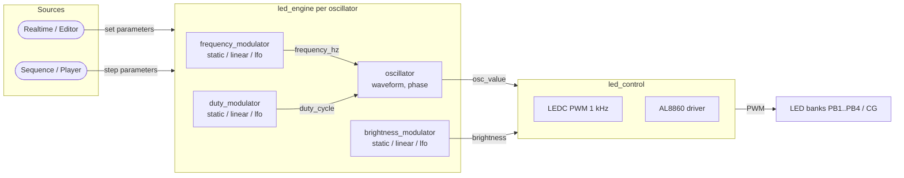

# Software Architecture

## Overview

The Morpheus HypnoLight firmware is an [ESP-IDF](https://docs.espressif.com/projects/esp-idf/en/latest/esp32s3/index.html) project located in the `firmware/` directory of the repository. It is structured as a set of ESP-IDF components, each responsible for a distinct part of the device behavior.

The firmware implements two main operating modes described in the product specification:

- **Player Mode**: the `sequence` component advances stored steps and sends parameters to the `led_engine`.
- **Editor Mode**: commands from the `comms` layer or local controls write parameters directly into the `led_engine`.

Both modes share the same `led_engine` signal generation pipeline, which contains per oscillator a frequency modulator, a brightness modulator, and an oscillator.

## Repository Layout

```text
firmware/
├── CMakeLists.txt          # Project declaration
├── sdkconfig               # Generated menuconfig, committed to git
├── sdkconfig.defaults      # Optional baseline configuration
├── main/                   # Application entry point
│   ├── CMakeLists.txt
│   └── main.c              # app_main(): initialization
└── components/             # Application components
    ├── oscillator/         # Software oscillator engine (LUT + DDS)
    ├── led_control/        # Fixed LEDC channel output
    ├── modulator/          # Generic static/linear/LFO value generator
    ├── led_engine/         # Per-oscillator control chain
    ├── sequence/           # Sequence engine (steps, playback)
    └── comms/              # BLE / Wi-Fi communication layer
```

## Components

### `oscillator`

Responsible for generating the five low-frequency signals that drive the four peripheral banks (PB1..PB4) and the central group (CG).

- **Waveforms**: sine, square, triangle, custom.
  - **Sine** and **custom** are pre-computed into a 64-sample LUT when static parameters change.
  - **Square** and **triangle** are generated directly from the phase accumulator and duty cycle each tick.
- **Static parameters per oscillator**: waveform and phase. They are applied at a sequence-step boundary through `oscillator_set_static()`; sine and custom rebuild the LUT, while square and triangle only store the new waveform and phase.
- **Dynamic parameters per oscillator**: frequency and duty cycle. Both are updated on the fly through `oscillator_set_frequency()` and `oscillator_set_duty_cycle()` without rebuilding any LUT.
- **Output**: normalized instantaneous waveform values `osc_values[5]` in the range `[0.0, 1.0]`. At 0 Hz, an oscillator returns a constant `1.0` regardless of waveform, phase, or duty cycle.
- **Implementation**: Direct Digital Synthesis (DDS) phase accumulator updated by `oscillator_tick()` at 1 kHz. Sine and custom use a 64-sample LUT; square and triangle are computed from phase and duty. The component is independent of LEDC and brightness control.
- **Public API**:
  - `esp_err_t oscillator_init(void)`
  - `esp_err_t oscillator_set_static(uint8_t oscillator_id, const oscillator_static_config_t *config)`
  - `esp_err_t oscillator_set_frequency(uint8_t oscillator_id, float frequency_hz)`
  - `esp_err_t oscillator_set_duty_cycle(uint8_t oscillator_id, float duty_cycle)`
  - `esp_err_t oscillator_tick(float osc_values[OSCILLATOR_COUNT])`

### `led_control`

Converts the normalized oscillator waveform and current brightness into the duty cycle written to the five fixed LEDC hardware channels, applying a gamma correction so that brightness ramps appear perceptually linear. It does not evaluate step timing, interpolation, or LFOs.

- **PB1–PB4**: LEDC channels 0–3 at a common carrier frequency and 10-bit resolution. Each channel controls the two LED sub-groups in its peripheral bank.
- **CG**: LEDC channel 4, using the same configuration as the peripheral banks.
- **Fixed mapping**: API oscillator IDs 0–3 map to PB1–PB4 / LEDC channels 0–3; ID 4 maps to CG / LEDC channel 4.
- **Duty calculation**: `final_duty = osc_value × gamma(current_brightness × global_brightness)`, where `gamma(x) = x^2.2` approximates the human eye response so that linear brightness ramps look perceptually smooth. All inputs are normalized to `[0.0, 1.0]`, and out-of-range values are clamped; invalid oscillator IDs and non-finite input values return an error.
- **LED off condition**: a `current_brightness` of `0.0` turns the oscillator off regardless of waveform, frequency, phase, or duty cycle.
- **Global brightness multiplier**: configurable at runtime through `led_control_set_global_brightness()`. The default is 1.0 (no attenuation). A single setting scales the overall lamp brightness; the test application sets it to 0.5 to limit eye strain.
- **Public API**:
  - `esp_err_t led_control_init(void)`
  - `esp_err_t led_control_update(uint8_t oscillator_id, float osc_value, float current_brightness)`
  - `esp_err_t led_control_set_global_brightness(float brightness)`
  - `float led_control_get_global_brightness(void)`
  - `esp_err_t led_control_all_off(void)`

### `sequence`

Step sequencer / playback engine. The realtime parameter evaluation previously implemented here has moved to the `led_engine` component. `sequence` now focuses on storing and advancing steps, then dispatching per-oscillator modulator configurations to `led_engine`.

- **Player mode**: reads a stored sequence and advances from step to step. Each step carries duration, static oscillator configuration, and modulator settings for frequency, brightness, and duty cycle.
- **Editor mode**: future commands from `comms` will write step data and playback commands into `sequence`.
- **Playback control**: play, pause, seek, loop, and tempo will be managed here.
- **Public data types**:
  - `sequence_step_t` with `duration_ms` and per-oscillator `sequence_oscillator_step_t`
  - `sequence_oscillator_step_t` with `oscillator_static_config_t` and `modulator_config_t` for `frequency_modulator`, `brightness_modulator`, and `duty_modulator`
- **Public API**:
  - `esp_err_t sequence_init(void)`
  - `esp_err_t sequence_load(const sequence_step_t *steps, uint32_t step_count)`
  - `esp_err_t sequence_play(void)`
  - `esp_err_t sequence_pause(void)`
  - `esp_err_t sequence_seek(uint32_t position_ms)`
  - internal timer drives `sequence_tick()` every `SEQUENCE_STEP_TICK_PERIOD_MS`
  - `bool sequence_is_playing(void)`
  - `uint32_t sequence_get_current_step(void)`

### `modulator`

Generic time-varying value generator used by `led_engine` for frequency and brightness. It supports three modes: `static`, `linear`, and `lfo`. The LFO has no LUT and supports sine (or a triangle approximation) and square with a fixed 50% duty cycle.

```c
/** @brief Modulator operating modes. */
typedef enum {
  MODULATOR_MODE_STATIC,
  MODULATOR_MODE_LINEAR,
  MODULATOR_MODE_LFO,
} modulator_mode_t;

/** @brief LFO waveforms supported by the modulator. */
typedef enum {
  MODULATOR_LFO_WAVEFORM_SINE,
  MODULATOR_LFO_WAVEFORM_SQUARE,
} modulator_lfo_waveform_t;

/** @brief Static mode configuration: a constant value. */
typedef struct {
  float value;
} modulator_static_config_t;

/** @brief Linear mode configuration: ramp from start to end over a duration. */
typedef struct {
  float start_value;
  float end_value;
  uint32_t duration_ms;
} modulator_linear_config_t;

/** @brief LFO mode configuration. */
typedef struct {
  modulator_lfo_waveform_t waveform;
  float frequency_hz;
  float low;
  float high;
} modulator_lfo_config_t;

/** @brief Complete modulator configuration. */
typedef struct {
  modulator_mode_t mode;
  modulator_static_config_t static_config;
  modulator_linear_config_t linear_config;
  modulator_lfo_config_t lfo_config;
} modulator_config_t;

/** @brief Modulator runtime state. */
typedef struct {
  modulator_config_t config;
  float current_value;
  float start_value;
  uint32_t elapsed_ms;
  float lfo_phase;
} modulator_state_t;

/** @brief Initialize a modulator to static zero. */
esp_err_t modulator_init(modulator_state_t *state);

/** @brief Apply a new configuration and capture internal start state. */
esp_err_t modulator_set_config(modulator_state_t *state, const modulator_config_t *config);

/** @brief Compute the next value after delta_time_ms. */
esp_err_t modulator_evaluate(modulator_state_t *state, float delta_time_ms, float *value);
```

### `led_engine`

Encapsulates the per-oscillator signal chain: a frequency modulator, a brightness modulator, and an oscillator. It receives parameter updates from `sequence` in Player mode or directly from `comms` / local controls in Editor mode, then drives `led_control`.

- **Per oscillator**:
  - `frequency_modulator`: instance of the `modulator` component. Output is in Hz and forwarded to `oscillator_set_frequency()`.
  - `brightness_modulator`: instance of the `modulator` component. Output is normalized `[0.0, 1.0]` and forwarded to `led_control_update()` as `current_brightness`; `led_control` treats it as a perceptual brightness value and applies a gamma correction.
  - `duty_modulator`: instance of the `modulator` component. Output is normalized `[0.0, 1.0]` and forwarded to `oscillator_set_duty_cycle()`.
  - `oscillator`: generates the waveform from `oscillator_static_config_t`, the current frequency, and the current duty cycle.
- **Evaluation**: at each 1 kHz tick the engine evaluates the frequency, brightness, and duty modulators, applies them through `oscillator_set_frequency()` and `oscillator_set_duty_cycle()`, then calls `oscillator_tick()`, and passes `osc_value` and `brightness` to `led_control_update()`.
- **Public API**:
  - `esp_err_t led_engine_init(void)`
  - `esp_err_t led_engine_set_static(uint8_t oscillator_id, const oscillator_static_config_t *config)`
  - `esp_err_t led_engine_set_frequency(uint8_t oscillator_id, float frequency_hz)`
  - `esp_err_t led_engine_set_brightness(uint8_t oscillator_id, float brightness)`
  - `esp_err_t led_engine_set_duty_cycle(uint8_t oscillator_id, float duty_cycle)`
  - `esp_err_t led_engine_linear_frequency(uint8_t oscillator_id, float start_value, float end_value, uint32_t duration_ms)`
  - `esp_err_t led_engine_linear_brightness(uint8_t oscillator_id, float start_value, float end_value, uint32_t duration_ms)`
  - `esp_err_t led_engine_linear_duty_cycle(uint8_t oscillator_id, float start_value, float end_value, uint32_t duration_ms)`
  - `esp_err_t led_engine_set_frequency_modulator(uint8_t oscillator_id, const modulator_config_t *config)`
  - `esp_err_t led_engine_set_brightness_modulator(uint8_t oscillator_id, const modulator_config_t *config)`
  - `esp_err_t led_engine_set_duty_cycle_modulator(uint8_t oscillator_id, const modulator_config_t *config)`
  - `esp_err_t led_engine_tick(void)`
  - `esp_err_t led_engine_all_off(void)`

### `comms`

Communication layer for remote control and configuration.

- **Bluetooth Low Energy (BLE)**: primary control channel from the mobile/desktop application.
- **Wi-Fi**: optional web server interface for configuration and control.
- **Protocol**: to be defined (commands for play/pause/seek, parameter updates, sequence upload).
- **Public API** (to be defined):
  - `comms_init()`
  - `comms_register_command_handler(...)`
  - `comms_send_status(...)`

## Data Flow

The `led_engine` pipeline is shared by both Player and Editor modes. `sequence` (Player mode) and direct commands (Editor mode) both feed the same engine; the engine evaluates the frequency and brightness modulators, drives the oscillator, and writes the final duty cycle through `led_control`.



## Runtime Architecture (FreeRTOS)

ESP-IDF includes FreeRTOS as the default real-time kernel. The firmware does not require a different RTOS such as Zephyr; FreeRTOS is sufficient for all timing, peripheral, and communication needs.

Proposed FreeRTOS tasks and timers:

|Task / Timer|Period|Responsibility|
|------------|------|--------------|
|`led_engine_timer`|1 ms (1 kHz)|Call `led_engine_tick()` to evaluate frequency, brightness, and duty modulators, apply `oscillator_set_frequency()` / `oscillator_set_duty_cycle()`, advance the oscillator, and pass each waveform value and effective brightness to `led_control`.|
|`sequencer_task`|10–50 ms|Future sequence playback: advance stored steps and dispatch modulator configurations to `led_engine`.|
|`input_task`|50–100 ms|Poll I2C rotary encoders and update parameters or sequence.|
|`display_task`|100–250 ms|Refresh the OLED display with current status.|
|`comms_task`|event-driven|Handle BLE/Wi-Fi events and dispatch commands.|
|`fan_task`|1 s|Read TMP36 temperature, update fan PWM.|
|`watchdog_task`|1 s|Feed the watchdog and monitor safety thresholds (temperature, stack).|

**Inter-task communication:**

- `led_engine` protects its per-oscillator modulator configuration with a critical section. Modulator evaluation, frequency publication to `oscillator`, oscillator ticking, and LED output updates happen sequentially in the 1 kHz timer callback.
- `led_control` protects the global brightness multiplier with a critical section; the final output is scaled in `led_control_update()`.
- `comms` posts commands to a FreeRTOS queue consumed by `sequence` or `input_task`.

## Build, Flash and Monitor

All commands are run from the `firmware/` directory.

```bash
idf.py set-target esp32s3
idf.py build
idf.py -p PORT flash
idf.py -p PORT monitor
```

For Visual Studio Code, use the ESP-IDF extension commands:

- **ESP-IDF: Build your Project**
- **ESP-IDF: Flash your Project**
- **ESP-IDF: Monitor your Device**

> **Important:** Always use the **`UART`** USB port of the DevKitC-1 for flashing and monitoring. See [SoftwareSetup.md](SoftwareSetup.md) for the full environment setup.

## Important `sdkconfig` Settings

The following ESP-IDF configuration options will be required or important for the project. They are typically set via `idf.py menuconfig` and committed in `sdkconfig`:

- **LEDC**: 5 channels, 10-bit resolution, using a common carrier frequency for PB1..PB4 and CG.
- **I2C**: master mode on GPIO1 (SDA) / GPIO2 (SCL) for the QWIIC bus.
- **ESP Timer**: periodic task-dispatched callback at 1 kHz for `oscillator_tick()` and LEDC output updates. The application does not rely on the FreeRTOS tick rate for oscillator timing.
- **BLE / Wi-Fi**: enable as needed for the `comms` component.

## Testing

### Visual Hardware Test

The current `main` application includes a visual oscillator test using a single task-dispatched `esp_timer` callback at 1 kHz. The callback calls `led_engine_tick()`, which evaluates the frequency and brightness modulators, advances the oscillator, and updates `led_control`. Linear ramps are therefore evaluated each millisecond inside the modulators.

The test stages use full per-channel brightness values; the global brightness multiplier is set to 0.5 in `app_main()` (`led_control_set_global_brightness(0.5f)`), scaling the effective output to 50% to reduce eye strain:

- PB1: 2 Hz square waveform with 50% duty cycle (set dynamically via `led_engine_set_duty_cycle()`).
- PB2: 2 Hz square waveform with 25% duty cycle (set dynamically via `led_engine_set_duty_cycle()`).
- PB3: 0.25 Hz triangle waveform.
- PB4: 0.25 Hz sine waveform.
- CG: 0 Hz fixed output, independent of waveform and phase.
- PB1 and PB2: 2 Hz square waveforms with a 180-degree phase offset.
- PB1: linear brightness ramp from 0% to 100% over 4 seconds at 0 Hz.
- PB2: linear frequency ramp from 0 Hz to 2 Hz over 4 seconds at full per-channel brightness.

This validates the oscillator-to-LEDC pipeline on hardware, including waveforms, duty cycle, frequency, zero-frequency behavior, relative phase, and visible realtime linear ramps. It does not replace deterministic unit tests of individual LUT samples, DDS phase increments, or sequence tick interpolation.

### Deferred Unit Tests

A future ESP-IDF Unity test application will be separate from the production firmware. It will build and flash independently, then run Unity `TEST_CASE` functions over the serial monitor. The first oscillator unit tests should cover initialization, zero-frequency output, waveform phase, DDS phase advancement, custom LUT copying, and argument validation.

## TBD / Future Sections

- Sequence file format (JSON or binary).
- BLE/Wi-Fi command protocol.
- Error handling and safety (thermal shutdown, watchdog).
- Fan control algorithm.
- Calibration and factory settings.
