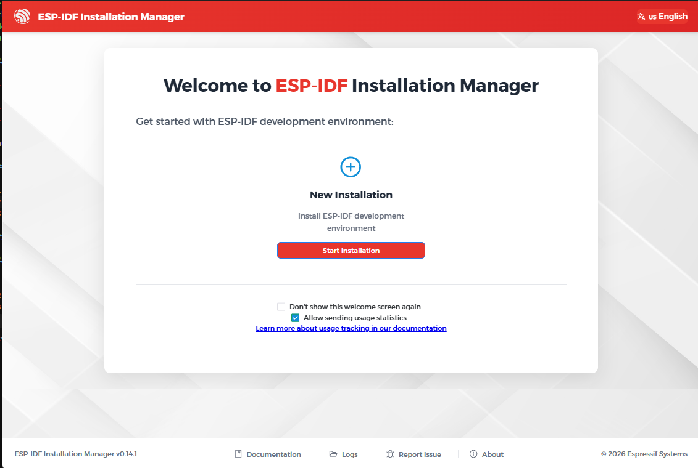
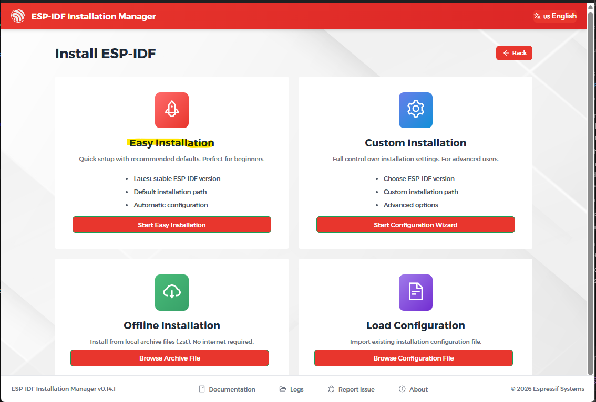
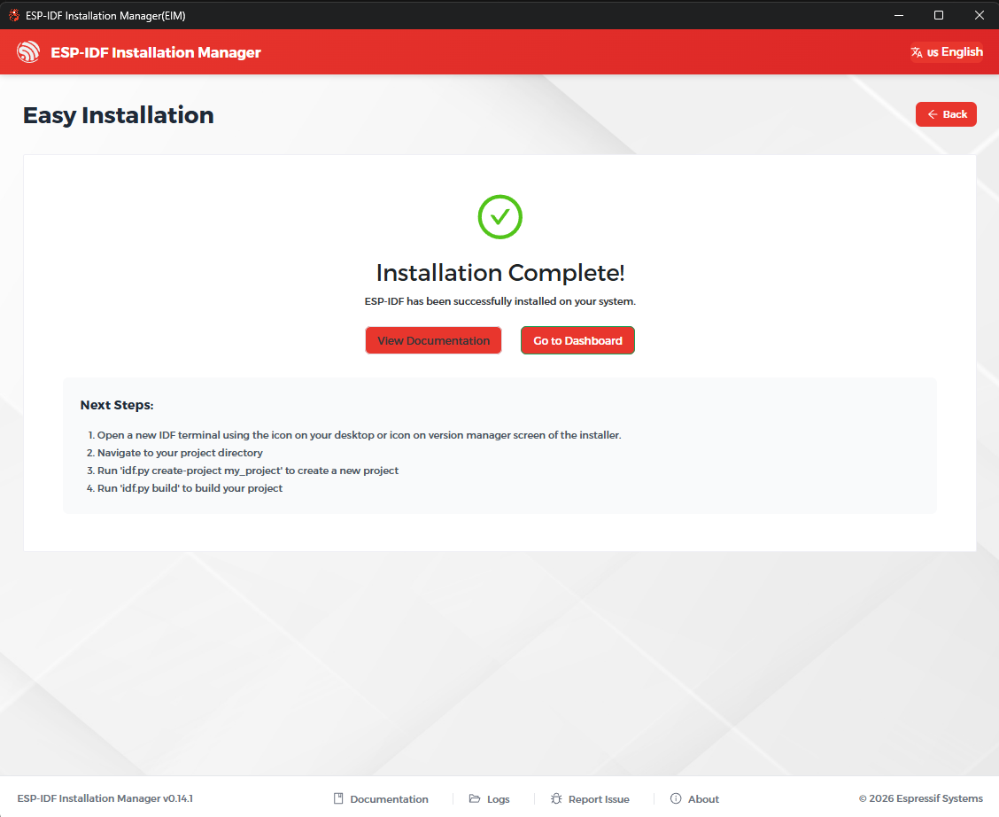
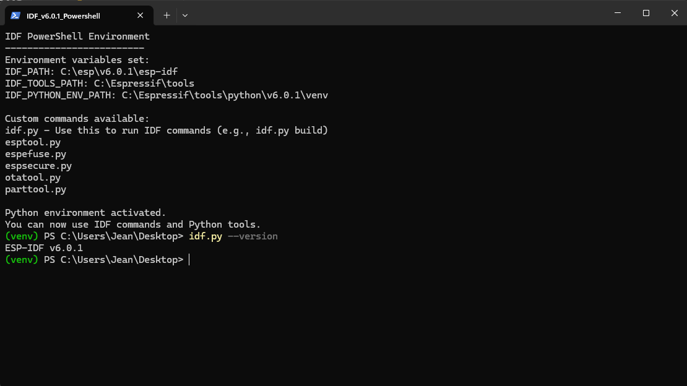

# Setup Software Development Environment

Software development for the ESP32-S3 will be done using the **ESP-IDF** framework inside **Visual Studio Code** (or the Devon/VS Code-based environment). The steps below describe the Windows installation procedure.

Reference: <https://docs.espressif.com/projects/esp-idf/en/latest/esp32s3/get-started/windows-setup.html>

> **Note:** The current Espressif documentation recommends the **ESP-IDF Installation Manager (EIM)** instead of the older standalone installer. As of June 2026, the EIM installs ESP-IDF **v6.0.1** by default.

## Prerequisites

- [x] Windows 10 or 11 (64-bit)
- [x] Git for Windows (from <https://git-scm.com/download/win>)
- [x] Python 3.11 or later (the installer can also embed Python automatically)
- [ ] USB cable to connect the ESP32-S3-DevKitC-1 board
- [ ] USB-to-UART driver for the ESP32-S3 DevKit (usually CP210x or CH340; Windows Update often installs it automatically)

## Step 1: Download the ESP-IDF Installation Manager (EIM)

1. Go to the EIM download page: <https://dl.espressif.com/dl/eim/>
2. Download the Windows installer for the **ESP-IDF Installation Manager** (e.g., `eim-gui-windows-x64.exe`).
3. Double-click the installer to start it.

## Step 2: Install ESP-IDF with the EIM

### GUI installation (recommended)

1. Launch the **ESP-IDF Installation Manager** after installation.
   

2. Select **Easy Installation** to install the latest stable ESP-IDF release with default settings.
   

3. Wait for the download and installation to complete.
   

The EIM will install:

- ESP-IDF source code
- Embedded Python
- Cross-compiler toolchains
- CMake and Ninja build tools
- OpenOCD debugger
- Required Python packages

## Step 3: Verify the Installation from the ESP-IDF Command Prompt

1. After installation, open the **ESP-IDF Command Prompt** shortcut (created in the Start menu).
2. Run the following command to verify that the tools are available:

   ```cmd
   idf.py --version
   ```

   It should display the ESP-IDF version (e.g., `ESP-IDF v6.0.1`).
   
3. Build a sample project to confirm everything works:

   ```cmd
   cd C:\esp\v6.0.1\esp-idf\examples\get-started\hello_world
   idf.py set-target esp32s3
   idf.py build
   ```

## Step 4: Install the ESP-IDF Extension in Visual Studio Code

1. Open **Visual Studio Code**.
2. Go to the **Extensions** view (Ctrl+Shift+X).
3. Search for **ESP-IDF** and install the official extension by **Espressif Systems**.
4. After installation, the extension usually detects the ESP-IDF environment automatically if it was installed with the EIM. If a configuration prompt appears, follow it; otherwise, open the Command Palette (Ctrl+Shift+P) and run: **ESP-IDF: Configure ESP-IDF Extension**.
5. If the extension asks for the installation folders, select:
   - ESP-IDF directory: `C:\esp\v6.0.1\esp-idf`
   - Tools directory: `C:\Users\<username>\.espressif`
6. Wait for the extension to finish the setup.
7. Open the Command Palette (Ctrl+Shift+P) and run: **ESP-IDF: Select current ESP-IDF version**. Choose the version installed by the EIM (e.g., **v6.0.1**).
8. If prompted, install the **clangd** extension (LLVM) for C/C++ code completion and navigation.

## Step 5: Flash the [Hello World Example](https://github.com/espressif/esp-idf/tree/master/examples/get-started/hello_world) from VS Code

> **USB port:** The ESP32-S3-DevKitC-1 has two USB connectors. Always use the **`UART`** port (CP2102N USB-to-UART bridge) for flashing and monitoring. The `USB` port (native USB) is for DFU/JTAG and requires additional setup.
>
> **Driver:** The `UART` port requires the **CP210x** driver from Silicon Labs. Windows Update usually installs it automatically; if a yellow exclamation mark appears in Device Manager, download it from <https://www.silabs.com/developers/usb-to-uart-bridge-vcp-drivers>. After connecting the board, a `COMx` entry should appear under **Ports (COM & LPT)**.

1. In VS Code, open the folder:
   - `C:\esp\v6.0.1\esp-idf\examples\get-started\hello_world`
2. Open the Command Palette and run: **ESP-IDF: Set Espressif Device Target**.
3. Select **ESP32-S3**. When prompted for the OpenOCD configuration, choose **`ESP32-S3 chip (via builtin USB-JTAG)`** (this is the correct option for the DevKitC-1; the ESP-PROG options are for external JTAG adapters on custom PCBs).
4. Connect the ESP32-S3-DevKitC-1 board to the computer via the **`UART`** USB port.
5. Run: **ESP-IDF: Select Flash Method** and choose **`UART`**.
6. Run: **ESP-IDF: Build your Project**.
7. Run: **ESP-IDF: Select Port to Use** and choose the `COMx` port corresponding to the ESP32-S3 (visible in Device Manager).
8. Run: **ESP-IDF: Flash your Project**.
9. Run: **ESP-IDF: Monitor your Device** to view the serial output.

## Step 5b: Build and Flash the Morpheus HypnoLight Firmware from VS Code

Because the ESP-IDF project lives in the `firmware/` subdirectory (not at the repository root), some ESP-IDF Explorer commands may not work directly. The recommended workflow is to use the **Open ESP-IDF Terminal** command.

1. In VS Code, open the Command Palette (`Ctrl+Shift+P`) and run: **ESP-IDF: Open ESP-IDF Terminal**.
   - This opens a new terminal with the ESP-IDF environment and Python virtual environment already loaded.
2. In the terminal, navigate to the firmware directory:

   ```powershell
   cd D:\Projects\DreamMachine\MorpheusHypnoLight\firmware
   ```

3. Set the target and build:

   ```powershell
   idf.py set-target esp32s3
   idf.py build
   ```

4. Flash and monitor the device:

   ```powershell
   idf.py -p COMx flash monitor
   ```

   Replace `COMx` with the port shown in Device Manager (e.g., `COM3`).

> **Note:** If the ESP-IDF Explorer commands (Build Project, Flash Device, Monitor Device, etc.) appear to do nothing, it is because the extension is looking for the project at the workspace root. Use the ESP-IDF Terminal workflow above instead.
>
> **Monitor exit:** To exit `idf.py monitor`, press `Ctrl+]` or use the sequence `Ctrl+T` then `Ctrl+X`. On AZERTY keyboards, `Ctrl+T` followed by `Ctrl+X` is usually easier than `Ctrl+]`. You may need to repeat the sequence once or twice.

## Step 6: Create the Morpheus HypnoLight Project

1. In VS Code, run: **ESP-IDF: Create New Empty Project**.
2. Choose `D:\Projects\DreamMachine\MorpheusHypnoLight` as the parent directory and name the project `firmware`. This creates the folder `firmware/` inside the repository root.
3. Set the target to **ESP32-S3**.
4. Verify the build with `idf.py build` from the integrated terminal or from the ESP-IDF Command Prompt.

### Project Directory Structure

The ESP-IDF project lives in the `firmware/` subdirectory of the repository. Keeping it in a subdirectory (rather than at the repository root) prevents the large `build/` output folder from cluttering the rest of the project.

```text
MorpheusHypnoLight/
├── doc/                        ← specifications and documentation
├── sim/                        ← simulation / PC-side tools
└── firmware/                   ← ESP-IDF project root
    ├── CMakeLists.txt          ← project declaration
    ├── sdkconfig               ← generated by menuconfig, committed to git
    ├── sdkconfig.defaults      ← optional baseline config
    ├── main/                   ← application entry point
    │   ├── CMakeLists.txt
    │   └── main.c              ← app_main(): top-level initialization
    ├── components/             ← reusable application components
    │   ├── oscillator/         ← software oscillator engine (LEDC PWM)
    │   │   ├── CMakeLists.txt
    │   │   ├── oscillator.h
    │   │   └── oscillator.c
    │   ├── led_control/        ← fixed LEDC channel output
    │   │   ├── CMakeLists.txt
    │   │   ├── led_control.h
    │   │   └── led_control.c
    │   ├── sequence/           ← sequence engine (steps, interpolation, LFO)
    │   │   ├── CMakeLists.txt
    │   │   ├── sequence.h
    │   │   └── sequence.c
    │   └── comms/              ← BLE / Wi-Fi communication layer
    │       ├── CMakeLists.txt
    │       ├── comms.h
    │       └── comms.c
    └── build/                  ← generated by idf.py build, gitignored
```

Each component under `components/` is an independent library with its own `CMakeLists.txt`. This maps directly to the modules described in `MHLSpecification.md`.

> **Note:** Add `firmware/build/` to `.gitignore` to avoid committing the several hundred MB of build artefacts.

## Additional Notes

- Keep installation paths under 90 characters and avoid spaces or special characters.
- If the ESP-IDF Command Prompt is not available, open a regular PowerShell or Command Prompt, navigate to the ESP-IDF directory, and run `export.ps1` or `export.bat` to activate the environment.
- The same setup applies to the Devon/VS Code-based environment; once the ESP-IDF extension is configured, the workflow is identical.

Once the firmware is built and flashed, the next step is to test the LED outputs with the simple LEDC test program in `firmware/main/main.c`.
